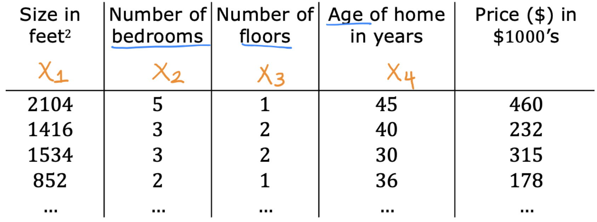
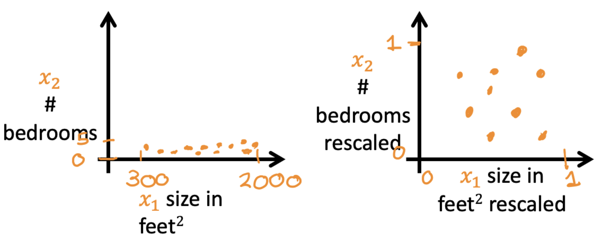
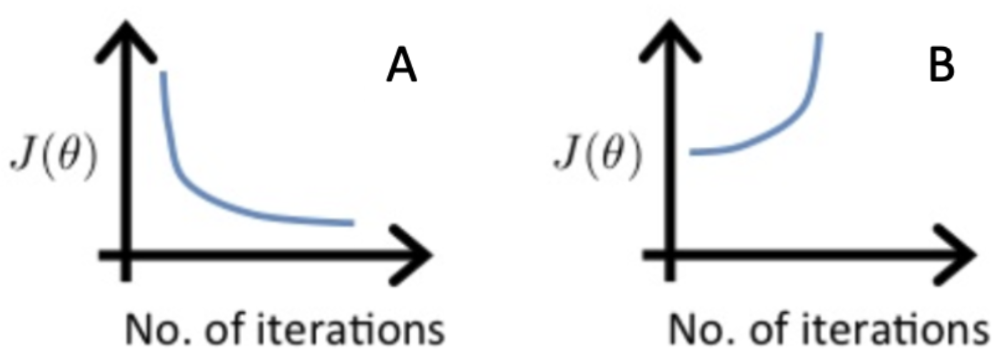
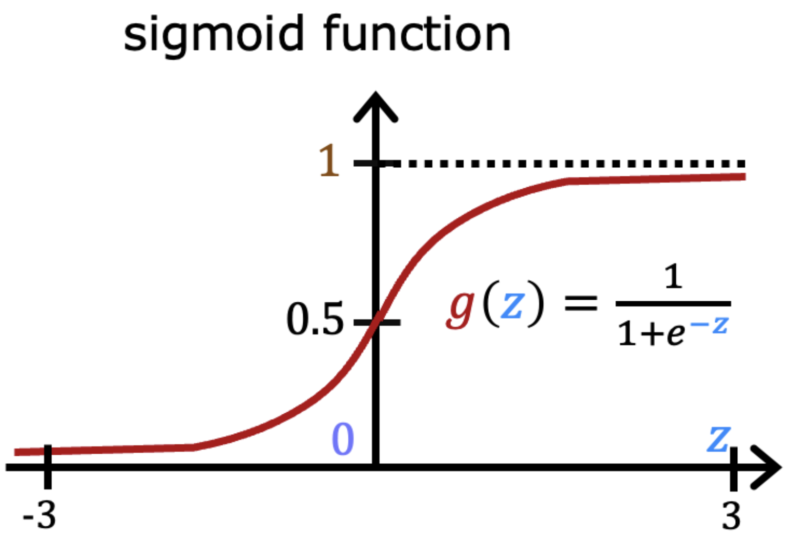
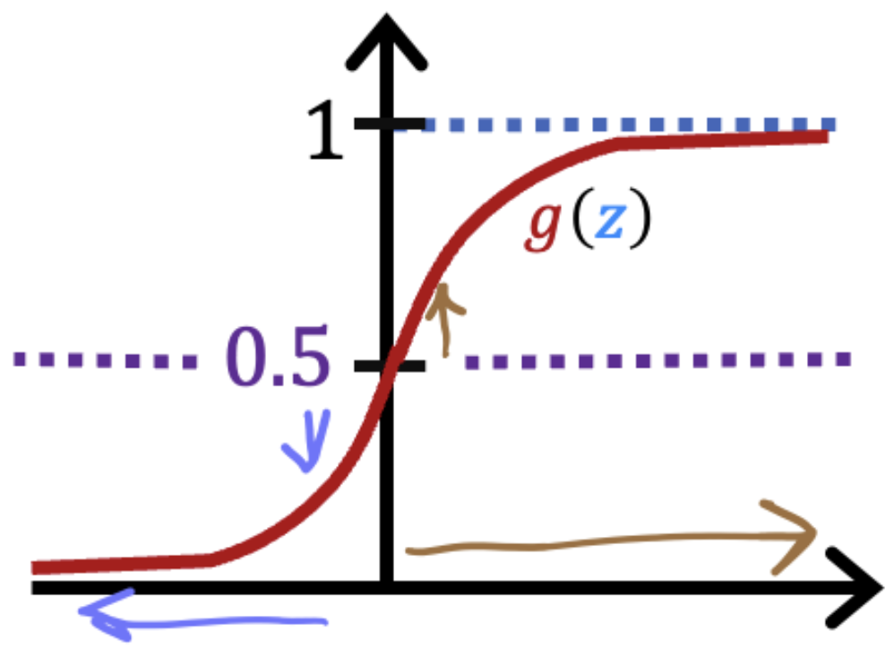
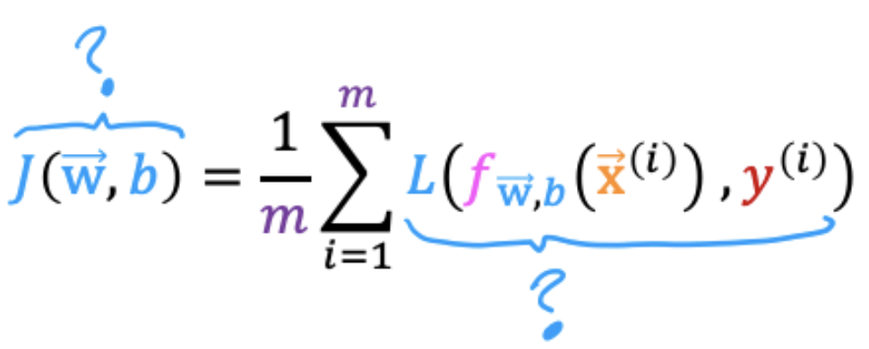
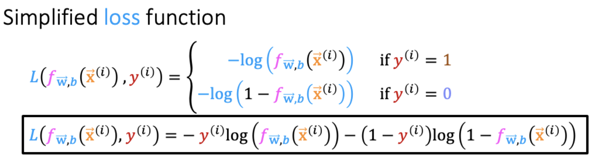
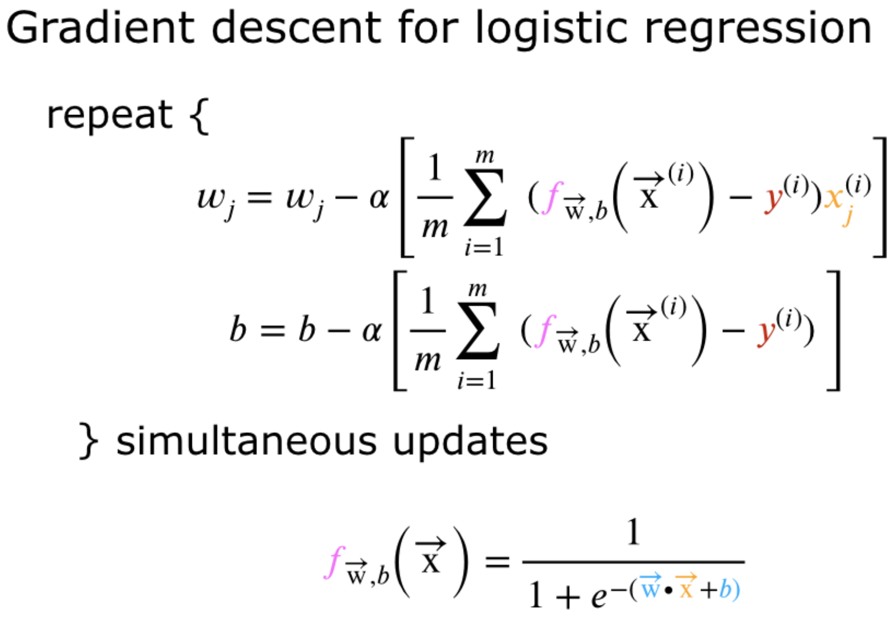
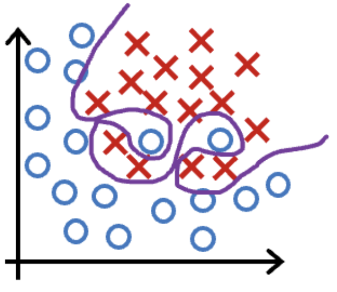

This file contains all the quizzes with answers and explanations for Course :one: of the Machine Learning Specialization from deeplearning.ai and Stanford. 

- [Week :one:](#week-one)
  - [Quiz :clock1:: Supervised vs unsupervised learning](#quiz-clock1-supervised-vs-unsupervised-learning)
  - [Quiz :clock2:: Regression Model](#quiz-clock2-regression-model)
  - [Quiz :clock3:: Train the model with gradient descent](#quiz-clock3-train-the-model-with-gradient-descent)
- [Week :two:](#week-two)
  - [Quiz :clock1:: Multiple linear regression](#quiz-clock1-multiple-linear-regression)
  - [Quiz :clock2:: Gradient descent in practice](#quiz-clock2-gradient-descent-in-practice)
- [Week :three:](#week-three)
  - [Quiz :clock1:: Classification with logistic regression](#quiz-clock1-classification-with-logistic-regression)
  - [Quiz :clock2:: Cost function for logistic regression](#quiz-clock2-cost-function-for-logistic-regression)
  - [Quiz :clock3:: Gradient descent for logistic regression](#quiz-clock3-gradient-descent-for-logistic-regression)
  - [Quiz :clock4:: The problem of overfitting](#quiz-clock4-the-problem-of-overfitting)

# Week :one:
## Quiz :clock1:: Supervised vs unsupervised learning

1. Which are the two common types of supervised learning? (Choose two)
    - [ ] Classification
    - [x] Regression
      - > Regression predicts a number among potentially infinitely possible numbers.
    - [x] Clustering
      - > Classification predicts from among a limited set of categories (also called classes). These could be a limited set of numbers or labels such as "cat" or "dog".
2. Which of these is a type of unsupervised learning?
    - [ ] Classification
    - [ ] Regression
    - [x] Clustering
      - > Clustering groups data into groups or clusters based on how similar each item (such as a hospital patient or shopping customer) are to each other.

## Quiz :clock2:: Regression Model

1. For linear regression, the model is $f_{w,b}(x) = wx + b$. Which of the following are the inputs, or features, that are fed into the model and with which the model is expected to make a prediction?
   - [ ] $w$ and $b$ 
   - [x] $x$ 
     - > The $x$, the input features, are fed into the model to generate a prediction $f_{w,b}(x)$
   - [ ] $(x,y)$
   - [ ] $m$
2. For linear regression, if you find parameters $w$ and $b$ so that $J(w,b)$ is very close to zero, what can you conclude? 
    - [ ] This is never possible -- there must be a bug in the code. 
    - [ ] The selected values of the parameters $w$ and $b$ cause the algorithm to fit the training set really poorly.
    - [x] The selected values of the parameters $w$ and $b$ b cause the algorithm to fit the training set really well.
      - > When the cost is small, this means that the model fits the training set well.

## Quiz :clock3:: Train the model with gradient descent

1. Gradient descent is an algorithm for finding values of parameters $w$ and $b$ that minimize the cost function $J$. 
$$ 
w = w - \alpha \frac{d}{dw} J(w,b) \\
b = b - \alpha \frac{d}{dw} J(w,b) 
$$
When $\frac{d J(w,b)}{dw}$  is a negative number (less than zero), what happens to $w$ after one update step? 
   - [ ] $w$ decreases.
   - [x] $w$ increases.
     - > The learning rate is always a positive number, so if you take $w$ minus a negative number, you end up with a new value for $w$ that is larger (more positive).
   - [ ] $w$ stays the same.
   - [ ] It is not possible to tell if $w$ will increase or decrease.
2. For linear regression, what is the update step for parameter b?
   - [ ] $b = b - \alpha \frac{1}{m} \sum_{i=1}^{m} (f(w,b)(x^{(i)}) - y^{(i)})$
   - [x] $b = b - \alpha \frac{1}{m} \sum_{i=1}^{m} (f(w,b)(x^{(i)}) - y^{(i)})x^{(i)}$
     - > The update step is $b - \alpha \frac{d J(w,b)}{dw}$ where $\frac{d J(w,b)}{dw}$ can be computed with this expression: $\sum_{i=1} (f(w,b)(x^{(i)}) - y^{(i)})$ 

# Week :two: 
## Quiz :clock1:: Multiple linear regression

1. In the training set below, what is $x_4^{(3)}$ ? Please type in the number below (this is an integer such as $123$, no decimal points).
   

- [x] $30$
  - > Yes! $x_4^{(3)}$ is the 4-th features (4-th column in the table) of the 3rd training example (3rd row in the table).

2. Which of the following are potential benefits of vectorization? Please choose the best option.
   - [ ] It makes your code run faster
   - [ ] It can make your code shorter 
   - [ ] It allows your code to run more easily on parallel compute hardware
   - [x] All of the above
     - > Correct! All of these are benefits of vectorization!
3. True/False? To make gradient descent converge about twice as fast, a technique that almost always works is to double the learning rate $\alpha$. 
   - [ ] True
   - [x] False
     - > Doubling the learning rate may result in a learning rate that is too large, and cause gradient descent to fail to find the optimal values for the parameters $w$ and $b$.

## Quiz :clock2:: Gradient descent in practice 

1. Which of the following is a valid step used during feature scaling? 

   - [ ] Add the mean (average) from each value and and then divide by the (max - min).
   - [x] Subtract the mean (average) from each value and then divide by the (max - min).
     - > This is called mean normalization.
2. Suppose a friend ran gradient descent three separate times with three choices of the learning rate $\alpha$ α and plotted the learning curves for each (cost $J$ for each iteration). For which case, A or B, was the learning rate $\alpha$ likely too large?

   - [ ] Both cases A and B
   - [ ] Neither case A nor B
   - [x] Case B only
     - > The cost is increasing as training continues, which likely indicates that the learning rate alpha is too large.
   - [ ] Case A only
3. Of the circumstances below, for which one is feature scaling particularly helpful?
   - [ ] Feature scaling is helpful when all the features in the original data (before scaling is applied) range from $0$ to $1$.
   - [x] Feature scaling is helpful when one feature is much larger (or smaller) than another feature.
     - > For example, the “house size” in square feet may be as high as $2,000$, which is much larger than the feature “number of bedrooms” having a value between $1$ and $5$ for most houses in the modern era.
4. You are helping a grocery store predict its revenue, and have data on its items sold per week, and price per item. What could be a useful engineered feature?
   - [ ] For each product, calculate the number of items sold divided by the price per item.
   - [x] For each product, calculate the number of items sold times price per item.
     - > This feature can be interpreted as the revenue generated for each product.
5. True/False? With polynomial regression, the predicted values $f_{w,b}(x)$ does not necessarily have to be a straight line (or linear) function of the input feature $x$.
- [x] True
  - > A polynomial function can be non-linear.  This can potentially help the model to fit the training data better.
- [ ] False

# Week :three: 
## Quiz :clock1:: Classification with logistic regression

1. Which is an example of a classification task?
   - [ ] Based on the size of each tumor, determine if each tumor is malignant (cancerous) or not.
   - [ ] Based on a patient's age and blood pressure, determine how much blood pressure medication (measured in milligrams) the patient should be prescribed.
   - [x] Based on a patient's blood pressure, determine how much blood pressure medication (a dosage measured in milligrams) the patient should be prescribed.
     - > This task predicts one of two classes, malignant or not malignant.
2. Recall the sigmoid function is $g(z) = \frac{1}{1 + e^{-z}}$. If $z$ is a large positive number, then:

- [ ] $g(z)$ will be near $0.5$
- [ ] $g(z)$ will be near $-1$
- [x] $g(z)$ will be near $1$
  - > Say $z=+100$. So $e^{-z}$ is then $e^{-100}$, a really small positive number. So, $g(z) = \frac{1}{1 + \text{a small positive number}}$ which is close to $1$.
- [ ] $g(z)$ will be near $0$
3. A cat photo classification model predicts $1$ if it's a cat, and $0$ if it's not a cat. For a particular photograph, the logistic regression model outputs $g(z)$ (a number between $0$ and $1$). Which of these would be a reasonable criteria to decide whether to predict if it's a cat? 

   - [ ] Predict it is a cat if $g(z) = 0.5$.
   - [x] Predict it is a cat if $g(z) \geq 0.5$.
     - > Think of $g(z)$ as the probability that the photo is of a cat. When this number is at or above the threshold of $0.5$, predict that it is a cat.
   - [ ] Predict it is a cat if $g(z) < 0.5$.
   - [ ] Predict it is a cat if $g(z) < 0.7$.
4. True/False? No matter what features you use (including if you use polynomial features), the decision boundary learned by logistic regression will be a linear decision boundary. 
   - [ ] True
   - [x] False
     - > The decision boundary can also be non-linear, as described in the lectures.

## Quiz :clock2:: Cost function for logistic regression

1. In this lecture series, "cost" and "loss" have distinct meanings. Which one applies to a single training example?

- [x] Loss
  - > In these lectures, loss is calculated on a single training example. It is worth noting that this definition is not universal. Other lecture series may have a different definition.
- [ ] Cost
- [ ] Both Loss and Cost
- [ ] Neither Loss nor Cost

2. For the simplified loss function, if the label $y^{(i)} = 0$, then what does this expression simplify to?

- [x] $-\log(1 - f_{\vec{w}, b}(x^{(i)}))$
  - > When $y^{(i)} = 0$, the first term reduces to zero.
- [ ] $\log(f_{\vec{w}, b}(x^{(i)}))$
- [ ] $\log(1 - f_{\vec{w}, b}(x^{(i)})) + \log(1 - f_{\vec{w}, b}(x^{(i)}))$
- [ ] $-\log(1 - f_{\vec{w}, b}(x^{(i)})) - \log(1 - f_{\vec{w}, b}(x^{(i)}))$

## Quiz :clock3:: Gradient descent for logistic regression

1. Which of the following two statements is a more accurate statement about gradient descent for logistic regression?

- [ ] The update steps are identical to the update steps for linear regression.
- [x] The update steps look like the update steps for linear regression, but the definition of $f_{\vec{w}, b}(x^{(i)})$ is different.
  - > For logistic regression, $f_{\vec{w}, b}(x^{(i)})$ is the sigmoid function instead of a straight line.

## Quiz :clock4:: The problem of overfitting

1. Which of the following can address overfitting?
   - [x] Collect more training data
     - > If the model trains on more data, it may generalize better to new examples.
   - [ ] Remove a random set of training examples
   - [x] Select a subset of the more relevant features.
     - > If the model trains on the more relevant features, and not on the less useful features, it may generalize better to new examples.
   - [x] Apply regularization
     - > Regularization is used to reduce overfitting.
2. You fit logistic regression with polynomial features to a dataset, and your model looks like this. What would you conclude? (Pick one).

- [ ] The model has high variance (overfit). Thus, adding data is, by itself, unlikely to help much. 
- [ ] The model has high bias (underfit). Thus, adding data is, by itself, unlikely to help much. 
- [ ] The model has high bias (underfit). Thus, adding data is likely to help
- [x] The model has high variance (overfit). Thus, adding data is likely to help
  - > The model has high variance (it overfits the training data). Adding data (more training examples) can help.

