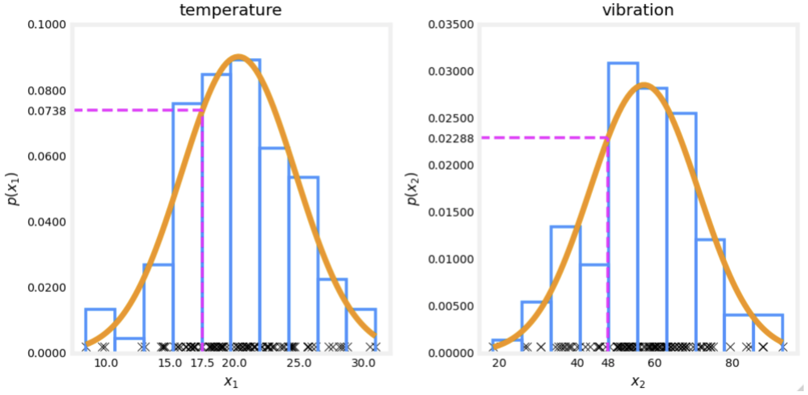
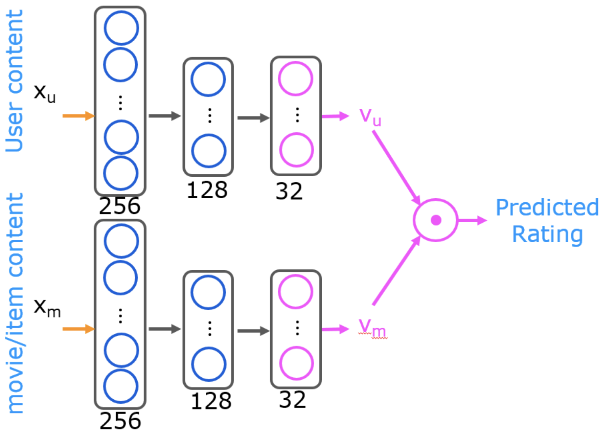
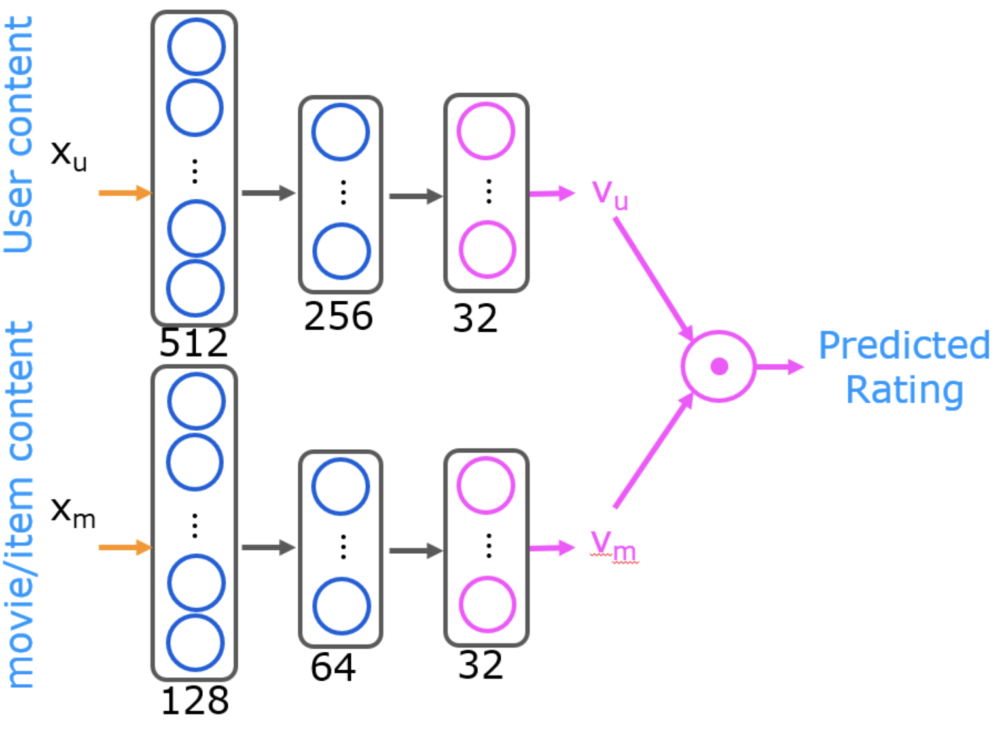
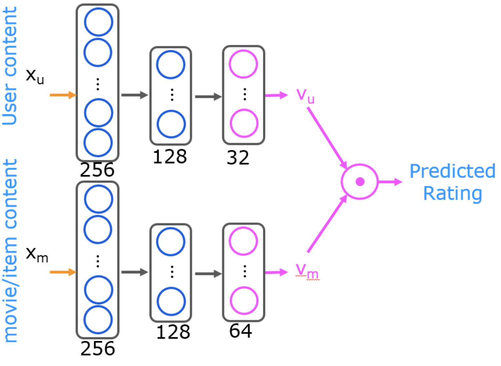
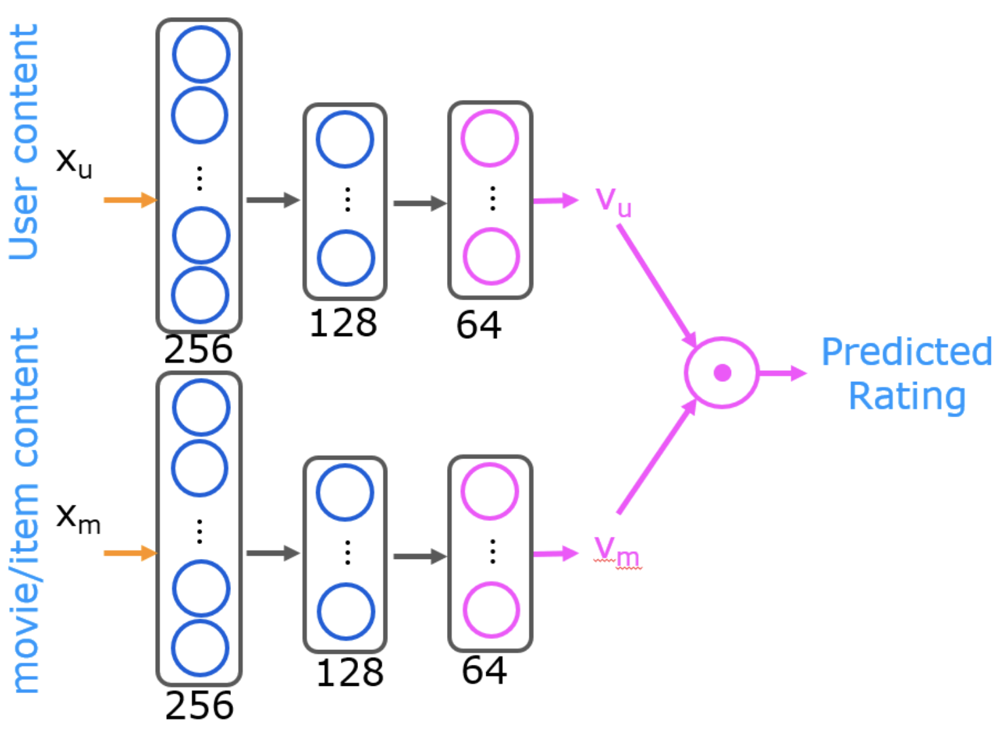
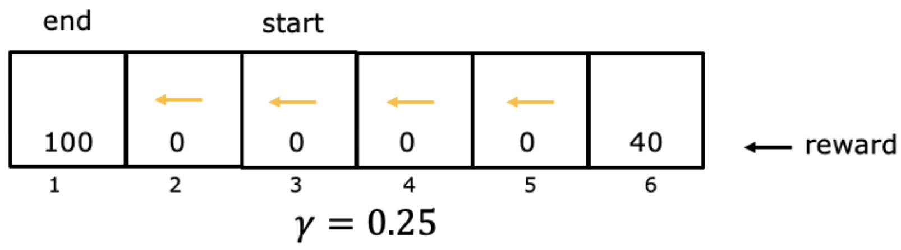
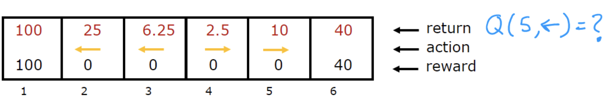

This file contains all the quizzes with answers and explanations for Course :three: of the Machine Learning Specialization from deeplearning.ai and Stanford.

- [Week :one: - Unsupervised learning](#week-one---unsupervised-learning)
  - [Quiz :clock1:: Clustering](#quiz-clock1-clustering)
  - [Quiz :clock2:: Anomaly detection](#quiz-clock2-anomaly-detection)
- [Week :two: - Recommender systems](#week-two---recommender-systems)
  - [Quiz :clock1:: Collaborative filtering](#quiz-clock1-collaborative-filtering)
  - [Quiz :clock2:: Recommender systems implementation](#quiz-clock2-recommender-systems-implementation)
  - [Quiz :clock3:: Content-based filtering](#quiz-clock3-content-based-filtering)
- [Week :three: - Reinforcement learning](#week-three---reinforcement-learning)
  - [Quiz :clock1:: Reinforcement learning introduction](#quiz-clock1-reinforcement-learning-introduction)
  - [Quiz :clock2:: State-action value function](#quiz-clock2-state-action-value-function)
  - [Quiz :clock3:: Continuous state spaces](#quiz-clock3-continuous-state-spaces)

---

# Week :one: - Unsupervised learning

## Quiz :clock1:: Clustering

1. Which of these best describes unsupervised learning? 

- [ ] A form of machine learning that finds patterns without using a cost function.
- [ ] A form of machine learning that finds patterns in data using only labels $(y)$ but without any inputs $(x)$.
- [x] A form of machine learning that finds patterns using unlabeled data $(x)$. 
  - > Unsupervised learning uses unlabeled data. The training examples do not have targets or labels "y". Recall the T-shirt example. The data was height and weight but no target size.
- [ ] A form of machine learning that finds patterns using labeled data $(x, y)$. 

2. Which of these statements are true about K-means? Check all that apply.

- [x] The number of cluster assignment variables $c^{(i)}$ is equal to the number of training examples.
  - > $c^{(i)}$ describes which centroid example $(i)$ is assigned to.
- [ ] The number of cluster centroids $\mu_k$ is equal to the number of examples.
- [ ] If you are running $K$-means with $K=3$ clusters, then each $c^{(i)}$ should be 1,2, or 3.
- [ ] If each example $x$ is a vector of $5$ numbers, then each cluster centroid $\mu_k$ is also going to be a vector of $5$ numbers.
  - > The dimension of $\mu_k$ matches the dimension of the examples.

3. You run $K$-means $100$ times with different initializations. How should you pick from the $100$ resulting solutions?

- [x] Pick the one with the lowest cost $J$
  - > $K$-means can arrive at different solutions depending on initialization. After running repeated trials, choose the solution with the lowest cost.
- [ ] Pick randomly -- that was the point of random initialization.
- [ ] Pick the last one (i.e., the 100th random initialization) because K-means always improves over time
- [ ] Average all 100 solutions together. 

4. You run $K$-means and compute the value of the cost function $J(c^{(1)}, ..., c^{(m)}, \mu_1, ..., \mu_k)$ after each iteration. Which of these statements should be true?

- [ ] There is no cost function for the K-means algorithm.
- [ ] The cost can be greater or smaller than the cost in the previous iteration, but it decreases in the long run.
- [ ] Because K-means tries to maximize cost, the cost is always greater than or equal to the cost in the previous iteration.
- [x] The cost will either decrease or stay the same after each iteration.
  - > The cost never increases. $K$-means always converges.

5. In $K$-means, the elbow method is a method to `___`

- [ ] Choose the best number of samples in the dataset
- [ ] Choose the maximum number of examples for each cluster
- [x] Choose the number of clusters $K$
  - > The elbow method plots a graph between the number of clusters K and the cost function. The ‘bend’ in the cost curve can suggest a natural value for K. Note that this feature may not exist or be significant in some data sets.
- [ ] Choose the best random initialization

## Quiz :clock2:: Anomaly detection

1. You are building a system to detect if computers in a data center are malfunctioning. You have $10,000$ data points of computers functioning well, and no data from computers malfunctioning. What type of algorithm should you use?

- [x] Anomaly detection
  - > Creating an anomaly detection model does not require labeled data.
- [ ] Supervised learning

2. You are building a system to detect if computers in a data center are malfunctioning. You have $10,000$ data points of computers functioning well, and $10,000$ data points of computers malfunctioning. What type of algorithm should you use?

- [ ] Anomaly detection
- [x] Supervised learning
  - > You have a sufficient number of anomalous examples to build a supervised learning model.

3. Say you have $5,000$ examples of normal airplane engines, and $15$ examples of anomalous engines. How would you use the $15$ examples of anomalous engines to evaluate your anomaly detection algorithm? 

- [x] Put the data of anomalous engines (together with some normal engines) in the cross-validation and/or test sets to measure if the learned model can correctly detect anomalous engines. 
  - > Anomalous examples are used to evaluate rather than train the model.
- [ ] Because you have data of both normal and anomalous engines, don’t use anomaly detection. Use supervised learning instead.
- [ ] You cannot evaluate an anomaly detection algorithm because it is an unsupervised learning algorithm. 
- [ ] Use it during training by fitting one Gaussian model to the normal engines, and a different Gaussian model to the anomalous engines. 

4. Anomaly detection flags a new input $x$ as an anomaly if $p(x) < \epsilon$. If we reduce the value of $\epsilon$, what happens?

- [ ] The algorithm is more likely to classify new examples as an anomaly.
- [x] The algorithm is less likely to classify new examples as an anomaly.
  - > When $\epsilon$ is reduced, the probability of an event being classified as an anomaly is reduced.
- [ ] The algorithm is more likely to classify some examples as an anomaly, and less likely to classify some examples as an anomaly. It depends on the example $x$.
- [ ] The algorithm will automatically choose parameters $\mu$ and $\sigma$ to decrease $p(x)$ and compensate. 

5. You are monitoring the temperature and vibration intensity on newly manufactured aircraft engines. You have measured $100$ engines and fit the Gaussian model described in the video lectures to the data. The $100$ examples and the resulting distributions are shown in the figure below. The measurements on the latest engine you are testing have a temperature of $17.5$ and a vibration intensity of $48$. These are shown in magenta on the figure below. What is the probability of an engine having these two measurements?

- [ ] $17.5 + 48 = 65.5$
- [ ] $17.5 * 48 = 840$
- [x] $0.0738 * 0.02288 = 0.00169$
  - > According to the model described in lecture, $p(A, B) = p(A) * p(B)$.
- [ ] $0.0738 + 0.02288 = 0.0966$

--- 

# Week :two: - Recommender systems 

## Quiz :clock1:: Collaborative filtering

| Movie | Elissa | Zach | Barry | Terry | 
| ----- | ------ | ---- | ----- | ----- | 
| Football Forever | 5 | 4 | 3 | ? |
| Pies, Pies, Pies | 1 | ? | 5 | 4 |
| Linear Algebra Live | 4 | 5 | ? | 1 |

1. You have the following table of movie ratings. Refer to the table above for question 1 and 2. Assume numbering starts at 1 for this quiz, so the rating for Football Forever by Elissa is at (1,1). What is the value of $n_u$. 

- `4`
  - > This is the number of users. $n_u$  is the number of movies/items and is 3 in this table.

2. What is the value of $r(2,2)$.

- `0`
  - > $r(i,j)$ is a $1$ if the movie has a rating and $0$ if it does not. In the table above, a question mark indicates there is no rating.

3. In which of the following situations will a collaborative filtering system be the most appropriate learning algorithm (compared to linear or logistic regression)?

- [x] You run an online bookstore and collect the ratings of many users. You want to use this to identify what books are "similar" to each other (i.e., if a user likes a certain book, what are other books that they might also like?)
  - > You can find "similar" books by learning feature values using collaborative filtering.
- [ ] You subscribe to an online video streaming service, and are not satisfied with their movie suggestions. You download all your viewing for the last 10 years and rate each item. You assign each item a genre. Using your ratings and genre assignment, you learn to predict how you will rate new movies based on the genre.
- [ ] You're an artist and hand-paint portraits for your clients. Each client gets a different portrait (of themselves) and gives you 1-5 star rating feedback, and each client purchases at most 1 portrait. You'd like to predict what rating your next customer will give you.
- [ ] You manage an online bookstore and you have the book ratings from many users. You want to learn to predict the expected sales volume (number of books sold) as a function of the average rating of a book.

4. For recommender systems with binary labels $y$, which of these are reasonable ways for defining when $y$ should be $1$ for a given user $j$ and item $i$ (Check all that apply.)

- [x] $y$ is $1$ if user $j$ fav/likes/clicks on item $i$ (after being shown the item)
  - > fav/likes/clicks on an item shows a user's interest in that item. It also shows that an item is interesting to a user.
- [ ] $y$ is $1$ if user $j$ has been shown item $i$ by the recommendation engine.
- [ ] $y$ is $1$ if user $j$ has not yet been shown item $i$ by the recommendation engine
- [x] $y$ is $1$ if user $j$ purchases item $i$ (after being shown the item)
  - > Purchasing an item shows a user's preference for that item. It also shows that an item is preferred by a user.

## Quiz :clock2:: Recommender systems implementation

1. Lecture described using ‘mean normalization’ to do feature scaling of the ratings. What equation below best describes this algorithm?

- [x] below

$$
y_{norm}(i, j) = y(i, j) - \mu_i \qquad \text{where} \\
\mu_i = \frac{1}{\sum_j r(i, j)} \sum_{j:r(i,j)=1} y(i, j)
$$

  - > This is the mean normalization algorithm described in lecture. This will result in a zero average value on a per-row basis.

- [ ] below

$$
y_{norm}(i, j) = \frac{y(i, j) - \mu_i}{max_i - min_i} \qquad \text{where} \\
\mu_i = \frac{1}{\sum_j r(i, j)} \sum_{j:r(i,j)=1} y(i, j)
$$

- [ ] below

$$
y_{norm}(i, j) = \frac{y(i, j) - \mu_i}{\sigma_i} \qquad \text{where} \\
\mu_i = \frac{1}{\sum_j r(i, j)} \sum_{j:r(i,j)=1} y(i, j) \\
\sigma_i^2 = \frac{1}{\sum_j r(i, j)} \sum_{j:r(i,j)=1} (y(i, j) - \mu_j)^2
$$

2. The implementation of collaborative filtering utilized a custom training loop in TensorFlow. Is it true that TensorFlow always requires a custom training loop?

- [ ] Yes. TensorFlow gains flexibility by providing the user primitive operations they can combine in many ways.
- [x] No: TensorFlow provides simplified training operations for some applications.
  - > Recall in Course :two:, you were able to build a neural network using a `model`, `compile`, `fit`, sequence which managed the training for you. A custom training loop was utilized in this situation because training $w, b$ and $x$ does not fit the standard layer paradigm of TensorFlow's neural network flow. There are alternate solutions such as custom layers, however, it is useful in this course to introduce you to this powerful feature of TensorFlow.

3. Once a model is trained, the 'distance' between features vectors gives an indication of how similar items are. The squared distance between the two vectors $x^{(k)}$ and $x^{(i)}$ is: $distance = || x^{(k)} - x^{(i)} ||^2 = \sum_{l=1}^n (x_l^{(k)} - x_l^{(i)})^2$. Using the table below, find the closest item to the movie "Pies, Pies, Pies".

| Movie | User $1$ | ... | User $n$ | $x_0$ | $x_1$ | $x_2$ | 
| ----- | -------- | --- | -------- | ----- | ----- | ----- |
| Pastries for Supper | | | | 2.0 | 2.0 | 1.0 | 
| Pies, Pies, Pies | | | | 2.0 | 3.0 | 4.0 | 
| Pies and You | | | | 5.0 | 3.0 | 4.0 | 

- [ ] Pastries for Supper
- [x] Pies and You
  - > The distance from ‘Pies, Pies, Pies’ is $9 + 0 + 0 = 9$.

4. Which of these is an example of the cold start problem? (Check all that apply.) 

- [ ] A recommendation system is so computationally expensive that it causes your computer CPU to heat up, causing your computer to need to be cooled down and restarted. 
- [x] A recommendation system is unable to give accurate rating predictions for a new product that no users have rated. 
  - > A recommendation system uses product feedback to fit the prediction model.
- [x] A recommendation system is unable to give accurate rating predictions for a new user that has rated few products. 
  - > A recommendation system uses user feedback to fit the prediction model.
- [ ] A recommendation system takes so long to train that users get bored and leave. 

## Quiz :clock3:: Content-based filtering

1. Vector $x_u$ and vector $x_m$ must be of the same dimension, where $x_u$ is the input features vector for a user (age, gender, etc.) $x_m$ is the input features vector for a movie (year, genre, etc.) True or false? 

- [ ] True
- [x] False
  - > These vectors can be different dimensions.

2. If we find that two movies, $i$ and $k$ have vectors $v_m^{(i)}$ and $v_m^{(k)}$ that are similar to each other (e.g., $|| v_m^{(i)} - v_m^{(k)} ||$) is small), then which of the following is likely to be true? Pick the best answer. 

- [ ] The two movies are very dissimilar.
- [ ] A user that has watched one of these two movies has probably watched the other as well. 
- [ ] We should recommend to users one of these two movies, but not both. 
- [x] The two movies are similar to each other and will be liked by similar users.
  - > Similar movies generate similar $v_m$'s.

3. Which of the following neural network configurations are valid for a content based filtering application? Please note carefully the dimensions of the neural network indicated in the diagram. Check all the options that apply:

- [x] Both the user and the item networks have the same architecture. 

  - > User and item networks can be the same or different sizes.

- [x] The user and the item networks have different architectures

  - > User and item networks can be the same or different sizes.

- [ ] The user vector $v_u$ is $32$ dimensional, and the item vector $v_m$ is $64$ dimensional.

- [x] The user and item networks have $64$ dimensional $v_u$ and $v_m$ vector respectively.

  - > Feature vectors can be any size so long as $v_u$ and $v_m$ are the same size.

4. You have built a recommendation system to retrieve musical pieces from a large database of music, and have an algorithm that uses separate retrieval and ranking steps. If you modify the algorithm to add more musical pieces to the retrieved list (i.e., the retrieval step returns more items), which of these are likely to happen? Check all that apply.

- [x] The system’s response time might increase (i.e., users have to wait longer to get recommendations)
  - > A larger retrieval list may take longer to process which mayincrease response time.
- [ ] The system’s response time might decrease (i.e., users get recommendations more quickly) 
- [ ] The quality of recommendations made to users should stay the same or worsen.
- [x] The quality of recommendations made to users should stay the same or improve.
  - > A larger retrieval list gives the ranking system more options to choose from which should maintain or improve recommendations. 

5. To speed up the response time of your recommendation system, you can pre-compute the vectors v_m for all the items you might recommend. This can be done even before a user logs in to your website and even before you know the $x_u$ or $v_u$ vector. True/False?

- [x] True
  - > The output of the item/movie neural network, $v_m$  is not dependent on the user network when making predictions. Precomputing the results speeds up the prediction process.
- [ ] False

---

# Week :three: - Reinforcement learning

## Quiz :clock1:: Reinforcement learning introduction

1. You are using reinforcement learning to control a four legged robot. The position of the robot would be its `___`.

- [ ] Return
- [ ] Reward
- [ ] Action
- [x] State

2. You are controlling a Mars rover. You will be very very happy if it gets to state 1 (significant scientific discovery), slightly happy if it gets to state 2 (small scientific discovery), and unhappy if it gets to state 3 (rover is permanently damaged). To reflect this, choose a reward function so that:

- [x] $R(1) > R(2) > R(3)$, where $R(1)$ and $R(2)$ are positive and $R(3)$ is negative.
- [ ] $R(1) < R(2) < R(3)$, where $R(1)$ and $R(2)$ are negative and $R(3)$ is positive.
- [ ] $R(1) > R(2) > R(3)$, where $R(1)$, $R(2)$ and $R(3)$ is negative.
- [ ] $R(1) > R(2) > R(3)$, where $R(1)$, $R(2)$ and $R(3)$ is positive.

3. You are using reinforcement learning to fly a helicopter. Using a discount factor of $0.75$, your helicopter starts in some state and receives rewards $-100$ on the first step, $-100$ on the second step, and $1,000$ on the third and final step (where it has reached a terminal state). What is the return?

- [x] $-100 - 0.75*100 + 0.75^2*1000$
- [ ] $-100 - 0.25*100 + 0.25^2*1000$
- [ ] $-0.75*100 - 0.75^2*100 + 0.75^3*1000$ 
- [ ] $-0.25*100 - 0.25^2*100 + 0.25^3*1000$  

4. Given the rewards and actions below, compute the return from state 3 with a discount factor of $\gamma = 0.25$. 

- [ ] $25$
- [ ] $0.39$
- [x] $6.25$
  - > If starting from state $3$, the rewards are in states $3$, $2$, and $1$. The return is $0+(0.25) \times 0+(0.25)^2 \times 100=6.25$.
- [ ] $0$

## Quiz :clock2:: State-action value function

1. Which of the following accurately describes the state-action value function $Q(s,a)$?

- [x] It is the return if you start from state $s$, take action $a$ (once), then behave optimally after that. 
- [ ] It is the return if you start from state $s$ and repeatedly take action $a$.
- [ ] It is the return if you start from state $s$ and behave optimally.
- [ ] It is the immediate reward if you start from state $s$ and take action $a$ (once).

2. You are controlling a robot that has $3$ actions: $←$ (left), $→$ (right) and STOP. From $a$ given state $s$, you have computed $Q(s, ←) = -10, Q(s, →) = -20, Q(s, STOP) = 0$. What is the optimal action to take in state $s$? 

- [x] $STOP$
  - > Yes, because this has the greatest value.
- [ ] $←$ (left)
- [ ] $→$ (right)
- [ ] Impossible to tell

3. For this problem, $\gamma = 0.25$. The diagram below shows the return and the optimal action from each state. Please compute $Q(5, ←)$. 

- [x] $0.625$
  - > Yes, we get $0$ reward in state `5`. Then $0 * 0.25$ discounted reward in state `4`, since we moved left for our action. Now we behave optimally starting from state `4` onwards. So, we move right to state `5` from state `4` and receive $0 * 0.25^2$ discounted reward. Finally ,we move right in state `5` to staet `6` to receive a discounted reward of $40 * 0.25^3$. Adding thse together we get $0.625$.
- [ ] $0.391$
- [ ] $1.25$
- [ ] $2.5$

## Quiz :clock3:: Continuous state spaces

1. The Lunar Lander is a continuous state Markov Decision Process (MDP) because:

- [ ] The state has multiple numbers rather than only a single number (such as position in the $x$-direction).
- [x] The state contains numbers such as position and velocity that are continuous valued.
- [ ] The state-action value $Q(s,a)$ function outputs continuous valued numbers.
- [ ] The reward contains numbers that are continuous valued.

2. In the learning algorithm described in the videos, we repeatedly create an artificial training set to which we apply supervised learning where the input $x = (s, a)$ and the target, constructed using _Bellman_'s equations, is $y=$ `___`?

- [x] $y = R(s) + \gamma \max_{a'} Q(s', a')$ where $s'$ is the stateyou get to after taking action $a$ in state $s$. 
- [ ] $y = \max_{a'} Q(s', a')$ where $s'$ is the state you get to after taking action $a$ in staet $s$.
- [ ] $y = R(s') where $s'$ is the state you get to after taking action $a$ in state $s$.
- [ ] $y = R(s)$