This file contains all the quizzes with answers and explanations for Course :two: of the Machine Learning Specialization from deeplearning.ai and Stanford. 

- [Week :one: - Neural Networks](#week-one---neural-networks)
  - [Quiz :clock1:: Neural networks intuition](#quiz-clock1-neural-networks-intuition)
  - [Quiz :clock2:: Neural network model](#quiz-clock2-neural-network-model)
  - [Quiz :clock3:: Tensorflow implementation](#quiz-clock3-tensorflow-implementation)
  - [Quiz :clock4:: Neural network implementation in Python](#quiz-clock4-neural-network-implementation-in-python)
- [Week :two: - Neural Network Training](#week-two---neural-network-training)
  - [Quiz :clock1:: Neural Network Training](#quiz-clock1-neural-network-training)
  - [Quiz :clock2:: Activation Functions](#quiz-clock2-activation-functions)
  - [Quiz :clock3:: Multiclass Classification](#quiz-clock3-multiclass-classification)
  - [Quiz :clock4:: Additional Neural Network Concepts](#quiz-clock4-additional-neural-network-concepts)
- [Week :three: - Advice for applying machine learning](#week-three---advice-for-applying-machine-learning)
  - [Quiz :clock1:: Advice for applying machine learning](#quiz-clock1-advice-for-applying-machine-learning)
  - [Quiz :clock2:: Bias and variance](#quiz-clock2-bias-and-variance)
  - [Quiz :clock3:: Machine learning development process](#quiz-clock3-machine-learning-development-process)
- [Week :four: - Decision trees](#week-four---decision-trees)
  - [Quiz :clock1:: Decision trees](#quiz-clock1-decision-trees)
  - [Quiz :clock2:: Decision tree learning](#quiz-clock2-decision-tree-learning)
  - [Quiz :clock3:: Tree ensembles](#quiz-clock3-tree-ensembles)

---

# Week :one: - Neural Networks
## Quiz :clock1:: Neural networks intuition

1. Which of these are terms used to refer to components of an artificial neural network? (hint: three of these are correct)


   - [ ] Axon
   - [x] Neurons
     - > Yes, a neuron is a part of a neural network
   - [x] Activation function
     - > Yes, an activation is the number calculated by a neuron (and “activations” in the figure above is a vector that is output by a layer that contains multiple neurons).
   - [x] layers
     - > Yes, a layer is a grouping of neurons in a neural network

2. True/False? Neural networks take inspiration from, but do not very accurately mimic, how neurons in a biological brain learn.
   - [x] True
     - > Artificial neural networks use a very simplified mathematical model of what a biological neuron does.
   - [ ] False

## Quiz :clock2:: Neural network model

1. For a neural network, what is the expression for calculating the activation of the third neuron in layer 2? Note, this is different from the question that you saw in the lecture video.

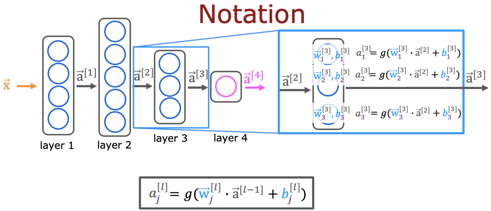

- [ ] $a_3^{[2]} = g( \vec{w}_2^{[3]} \cdot \vec{a}^{[1]} + b_2^{[3]})$
- [x] $a_3^{[2]} = g( \vec{w}_3^{[2]} \cdot \vec{a}^{[1]} + b_3^{[2]})$
  - > Yes! The superscript [2] refers to layer 2. The subscript 3 refers to the neuron in that layer. The input to layer 2 is the activation vector from layer 1.
- [ ] $a_3^{[2]} = g( \vec{w}_2^{[3]} \cdot \vec{a}^{[2]} + b_2^{[3]})$
- [ ] $a_3^{[2]} = g( \vec{w}_3^{[2]} \cdot \vec{a}^{[2]} + b_3^{[2]})$

2. For the handwriting recognition task discussed in lecture, what is the output $a_1^{[3]}$?

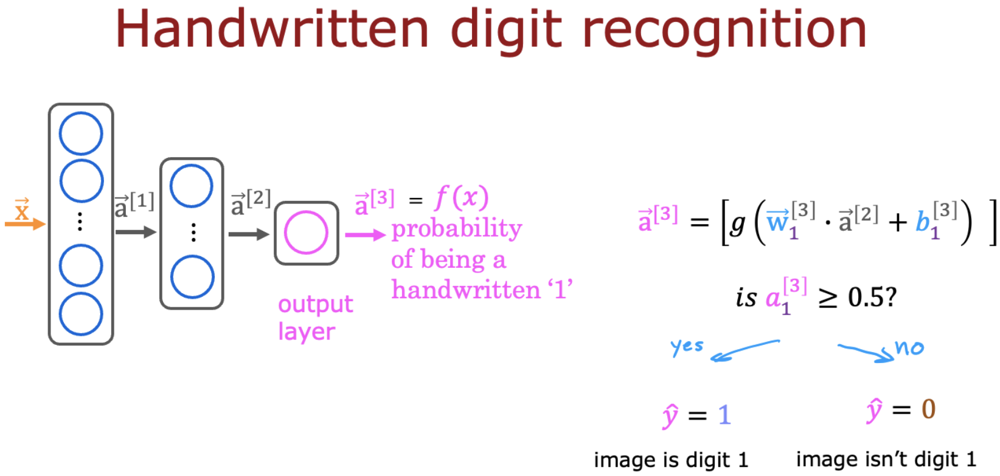

- [x] The estimated probability that the input image is of a number $1$, a number that ranges from $0$ to $1$.
  - > Yes! The neural network outputs a single number between $0$ and $1$.
- [ ] A vector of several numbers that take values between $0$ and $1$.
- [ ] A vector of several numbers, each of which is either exactly $0$ or $1$.
- [ ] A number that is either exactly $0$ or $1$, comprising the network’s prediction.

## Quiz :clock3:: Tensorflow implementation

1. For the the following code: This code will define a neural network with how many layers?

```python
model = Sequential([
  Dense(units=25, activation="sigmoid"),
  Dense(units=15, activation="sigmoid"),
  Dense(units=10, activation="sigmoid"),
  Dense(units=1, activation="sigmoid")
])
```

- [ ] $25$
- [ ] $5$
- [ ] $3$
- [x] $4$
  - > Yes! Each call to the "Dense" function defines a layer of the neural network.

2. How do you define the second layer of a neural network that has 4 neurons and a sigmoid activation?

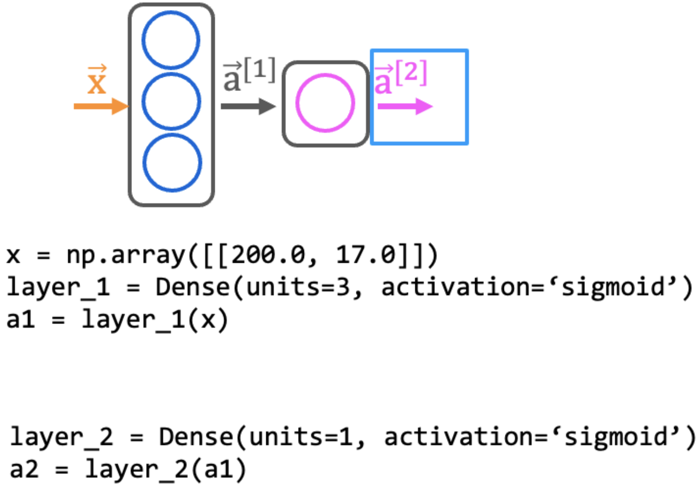

- [ ] `Dense(layer=2, units=4, activation = ‘sigmoid’)`
- [x] `Dense(units=4, activation=‘sigmoid’)`
  - > Yes! This will have $4$ neurons and a sigmoid activation.
- [ ] `Dense(units=[4], activation=[‘sigmoid’])`
- [ ] `Dense(units=4)`


3. If the input features are temperature (in Celsius) and duration (in minutes), how do you write the code for the first feature vector $x$ shown above?

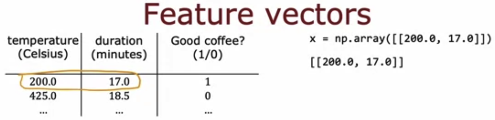

- [ ] `x = np.array([[200.0],[17.0]])`
- [ ] `x = np.array([[200.0 + 17.0]])`
- [x] `x = np.array([[200.0, 17.0]])`
  - > Yes! A row contains all the features of a training example. Each column is a feature.
- [ ] `x = np.array([[‘200.0’, ’17.0’]])`


## Quiz :clock4:: Neural network implementation in Python

1. According to the lecture, how do you calculate the activation of the third neuron in the first layer using NumPy?

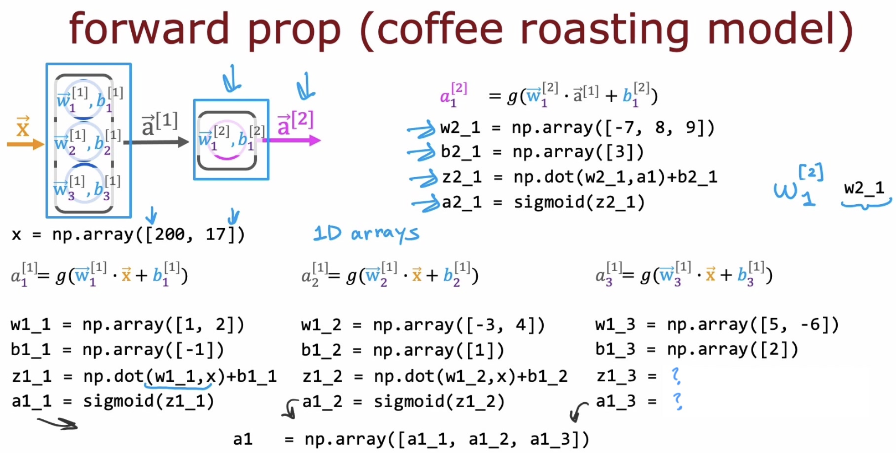

- [ ] below:
```
layer_1 = Dense(units=3, activation='sigmoid')
a_1 = layer_1(x)
```
- [ ] below:
```
z1_3 =w1_3 * x + b
a1_3 = sigmoid(z1_3)
```
- [x] below:
```
z1_3 = np.dot(w1_3, x) + b1_3
a1_3 = sigmoid(z1_3)
```
  - > Correct. Use the `numpy.dot` function to take the dot product. The sigmoid function shown in lecture can be a function that you write yourself (see course :one:, week :three: of this specialization), and that will be provided to you in this course.


2. According to the lecture, when coding up the numpy array $W$, where would you place the $w$ parameters for each neuron?

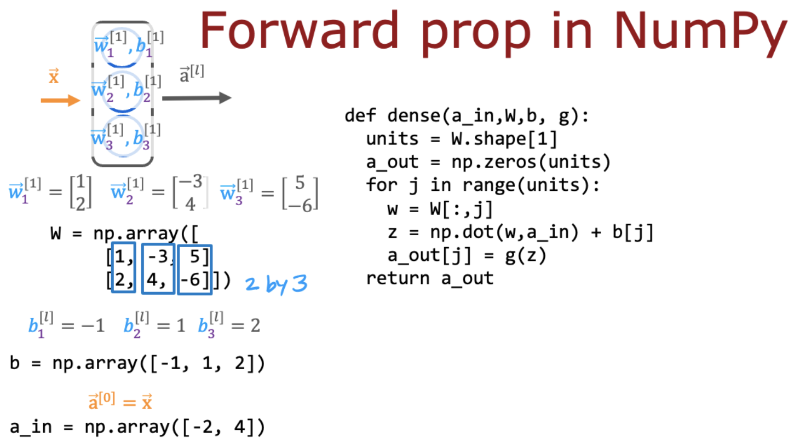

- [ ] In the rows of $W$.
- [x] In the columns of $W$.
  - > Correct. The $w$ parameters of neuron $1$ are in column $1$. The $w$ parameters of neuron 2 are in column $2$, and so on.

1. For the code above in the "dense" function that defines a single layer of neurons, how many times does the code go through the "for loop"? Note that $W$ has $2$ rows and $3$ columns.

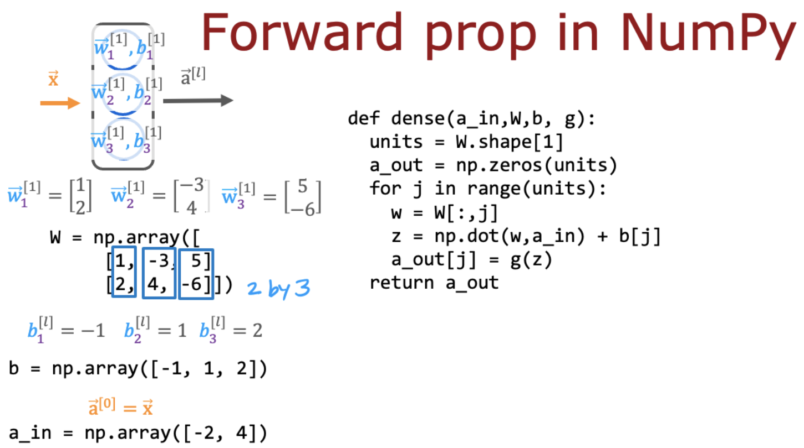

- [x] $3$ times
  - > Yes! For each neuron in the layer, there is one column in the numpy array W. The for loop calculates the activation value for each neuron. So if there are $3$ columns in $W$, there are 3 neurons in the dense layer, and therefore the for loop goes through $3$ iterations (one for each neuron).
- [ ] $2$ times
- [ ] $6$ times
- [ ] $5$ times

---

# Week :two: - Neural Network Training

## Quiz :clock1:: Neural Network Training

1. Here is some code that you saw in the lecture. For which type of task would you use the binary cross entropy loss function?

```python
  model.compile(loss=BinaryCrossentropy())
```


- [x] Binary classification (classification with exactly $2$ classes).
  - > Yes! Binary cross entropy, which we've also referred to as logistic loss, is used for classifying between two classes (two categories). 
- [ ] Regression tasks (tasks that predict a number).
- [ ] `BinaryCrossentropy()`` should not be used for any task. 
- [ ] A classification task that has 3 or more classes (categories).

2. Here is code that you saw in the lecture. Which line of code updates the network parameters in order to reduce the cost?

```python
  model = Sequential([
    Dense(units=25, activation='sigmoid’),
    Dense(units=15, activation='sigmoid’),
    Dense(units=1, activation='sigmoid’)
  ])

  model.compile(loss=BinaryCrossentropy())
  model.fit(X,y,epochs=100)
```

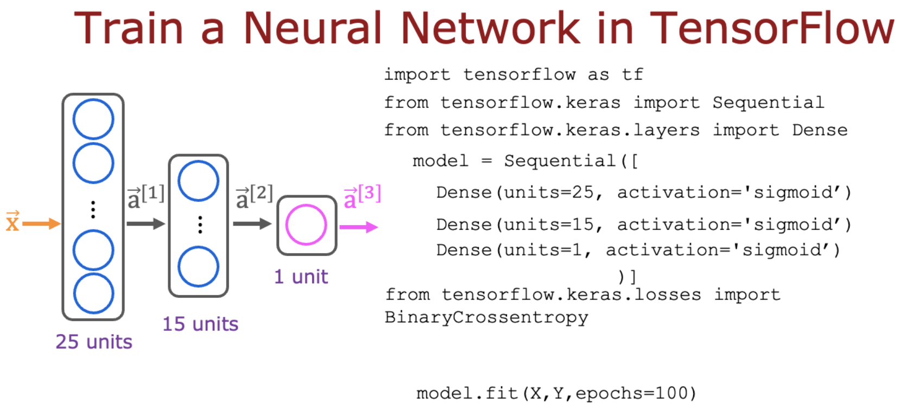

- [ ] None of the above -- this code does not update the network parameters. 
- [x] `model.fit(X,y,epochs=100)`
  - > Yes! The third step of model training is to train the model on data in order to minimize the loss (and the cost)
- [ ] `model = Sequential([...])`
- [ ] `model.compile(loss=BinaryCrossentropy())`

## Quiz :clock2:: Activation Functions

1. Which of the following activation functions is the most common choice for the hidden layers of a neural network?

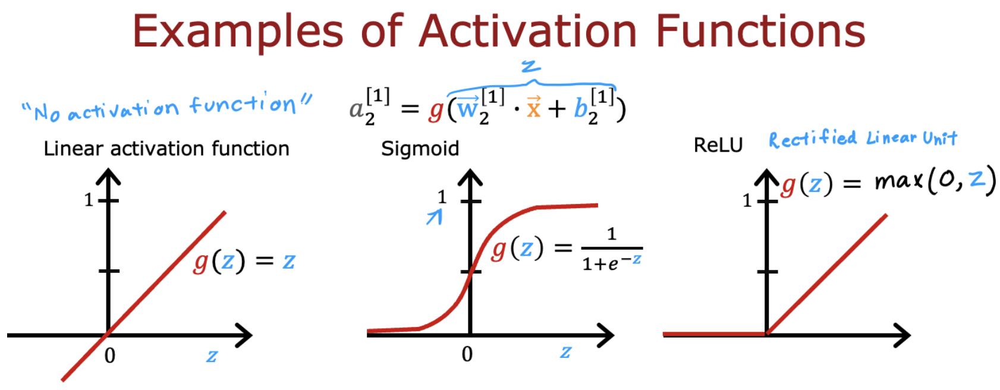

- [ ] Sigmoid
- [ ] Linear
- [ ] Most hidden layers do not use any activation function
- [x] _ReLU_ (recitfied linear unit)
  - > Yes! A _ReLU_ is most often used because it is faster to train compared to the _sigmoid_. This is because the _ReLU_ is only flat on one side (the left side) whereas the _sigmoid_ goes flat (horizontal, slope approaching zero) on both sides of the curve.

2. For the task of predicting housing prices, which activation functions could you choose for the output layer? Choose the 2 options that apply.

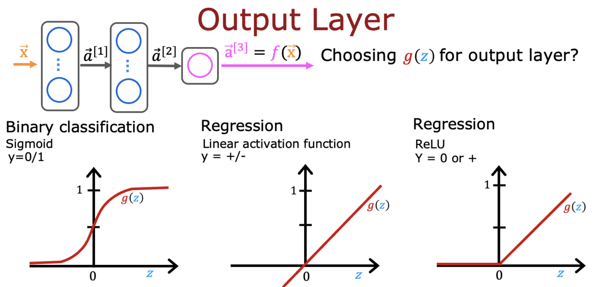

- [x] Linear
  - > Yes! A linear activation function can be used for a regression task where the output can be both negative and positive, but it's also possible to use it for a task where the output is $0$ or greater (like with house prices).
- [x] _ReLU_
  - > Yes! _ReLU_ outputs values $0$ or greater, and housing prices are positive values.
- [ ] _Sigmoid_

3. True/False? A neural network with many layers but no activation function (in the hidden layers) is not effective; that’s why we should instead use the linear activation function in every hidden layer. 

- [ ] True
- [x] False
  - > Yes! A neural network with many layers but no activation function is not effective. A linear activation is the same as "no activation function". 


## Quiz :clock3:: Multiclass Classification

1. For a multiclass classification task that has 4 possible outputs, the sum of all the activations adds up to $1$. For a multiclass classification task that has $3$ possible outputs, the sum of all the activations should add up to `___`.

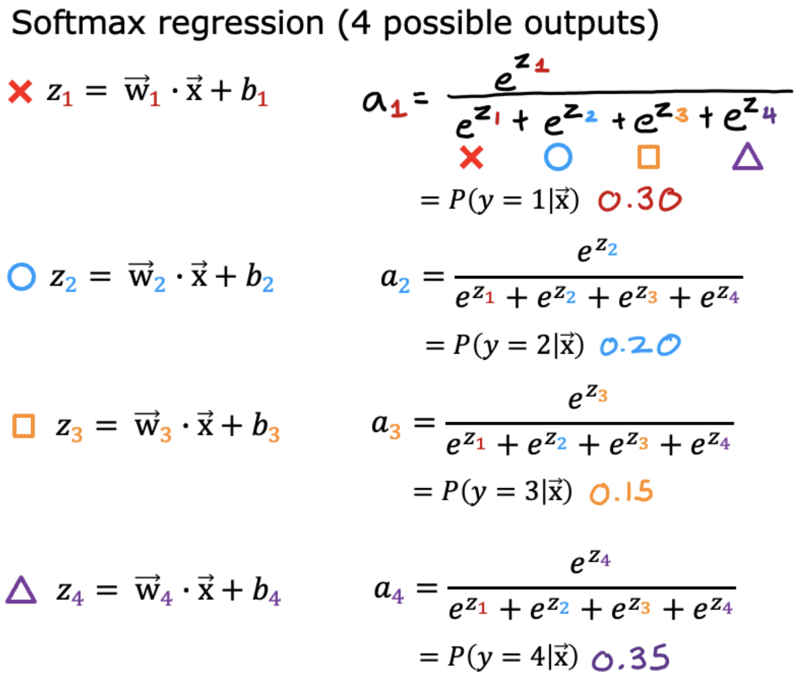

- [ ] Less than $1$.
- [ ] More than $1$. 
- [ ] It will vary, depending on the input `x`.
- [ ] $1$
  - > Yes! The sum of all the softmax activations should add up to $1$. One way to see this is that if $e^{z_1} = 10, e^{z_2} = 20, e^{z_3} = 30$, then the sum of $a_1 + a_2 + a_3$ is equal to $\frac{e^{z_1} + e^{z_2} + e^{z_3}}{e^{z_1} + e^{z_2} + e^{z_3}}$ which is $1$.

2. For multiclass classification, the cross entropy loss is used for training the model. If there are $4$ possible classes for the output, and for a particular training example, the true class of the example is class $3$ ($y=3$), then what does the cross entropy loss simplify to? (Hint: This loss should get smaller when $a_3$ gets larger.)


- [ ] $z_3$
- [x] $-\log (a_3)$
  - > Correct. When the true label is 3, then the cross entropy loss for that training example is just the negative of the log of the activation for the third neuron of the softmax. All other terms of the cross entropy loss equation $(-\log(a_1), -\log(a_2), \text{and} -\log(a_4))$ are ignored.

- [ ] $\frac{-\log(a_1)-\log(a_2)-\log(a_3)-\log(a_4)}{4}$
- [ ] $\frac{z_3}{z_1 + z_2 + z_3 + z_4}$

3. For multiclass classification, the recommended way to implement softmax regression is to set `from_logits=True` in the loss function, and also to define the model's output layer with `___`

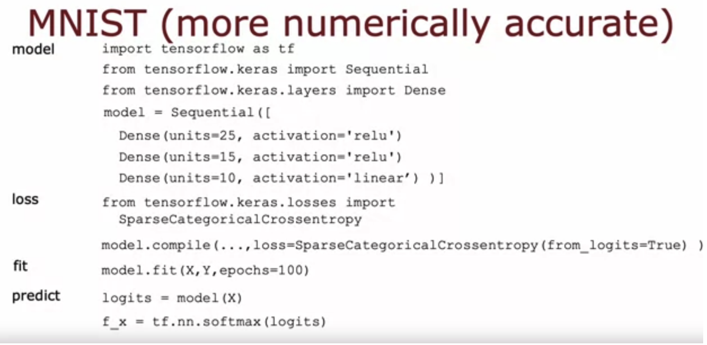

- [ ] A _softmax_ activation
- [x] A _linear_ activation
  - > Yes! Set the output as linear, because the loss function handles the calculation of the softmax with a more numerically stable method.

## Quiz :clock4:: Additional Neural Network Concepts

1. The Adam optimizer is the recommended optimizer for finding the optimal parameters of the model. How do you use the Adam optimizer in TensorFlow?

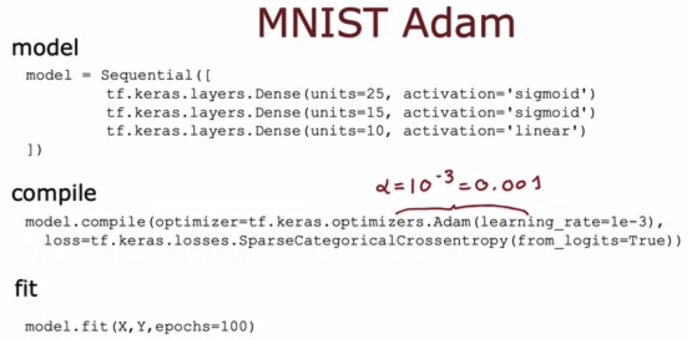

- [x] When calling `model.compile`, set `optimizer=tf.keras.optimizers.Adam (learning_rate=1e-3)`.
  - > Correct. Set the optimizer to Adam.
- [ ] The call to `model.compile()` will automatically pick the best optimizer, whether it is gradient descent, Adam or something else. So there’s no need to pick an optimizer manually. 
- [ ] The Adam optimizer works only with Softmax outputs. So if a neural network has a Softmax output layer, TensorFlow will automatically pick the Adam optimizer. 
- [ ] The call to `model.compile()` uses the Adam optimizer by default

2. The lecture covered a different layer type where each single neuron of the layer does not look at all the values of the input vector that is fed into that layer. What is this name of the layer type discussed in lecture?

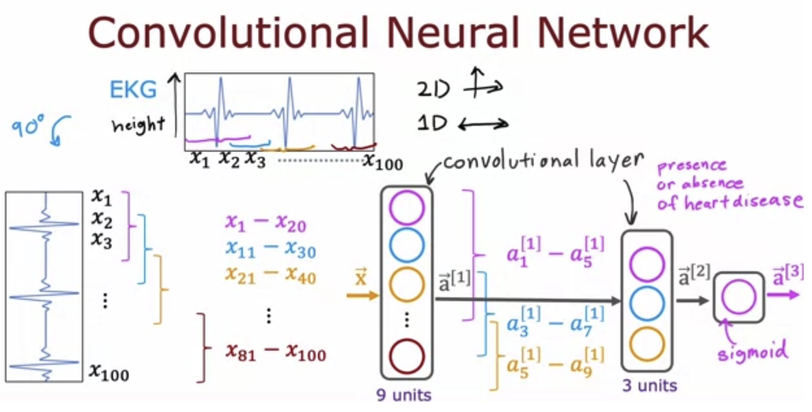

- [ ] Image layer
- [ ] A fully connected layer
- [x] Convolutional layer
  - > Correct. For a convolutional layer, each neuron takes as input a subset of the vector that is fed into that layer.
- [ ] 1D layer or 2D layer (depending on the input dimensions)

---

# Week :three: - Advice for applying machine learning

## Quiz :clock1:: Advice for applying machine learning

1. In the context of machine learning, what is a diagnostic?

- [ ] This refers to the process of measuring how well a learning algorithm does on a test set (data that the algorithm was not trained on). 
- [ ] An application of machine learning to medical applications, with the goal of diagnosing patients’ conditions. 
- [x] A test that you run to gain insight into what is/isn’t working with a learning algorithm.
  - > Yes! A diagnostic is a test that you run to gain insight into what is/isn’t working with a learning algorithm, to gain guidance into improving its performance.
- [ ] A process by which we quickly try as many different ways to improve an algorithm as possible, so as to see what works.

2. True/False? It is always true that the better an algorithm does on the training set, the better it will do on generalizing to new data. 

- [ ] True 
- [x] False
  - > Actually, if a model overfits the training set, it may not generalize well to new data.

3. For a classification task; suppose you train three different models using three different neural network architectures. Which data do you use to evaluate the three models in order to choose the best one? 

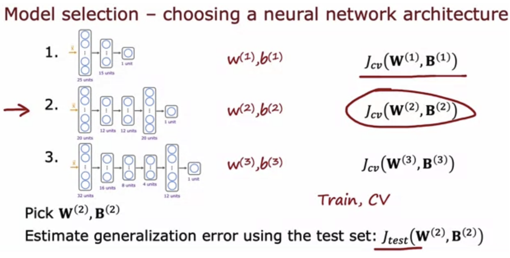

- [ ] The test set
- [ ] The training set
- [ ] All the data -- training, cross validation and test sets put together. 
- [x] The cross validation set
  - > Correct. Use the cross validation set to calculate the cross validation error on all three models in order to compare which of the three models is best.


## Quiz :clock2:: Bias and variance

1. If the model's cross validation error $J_{cv}$ is much higher than the training error $J_{train}$, this is an indication that the model has `___`


- [ ] Low variance
- [ ] Low bias
- [ ] High bias 
- [x] High variance
  - > When $J_{cv} >> J_{train}$ (whether $J_{train}$ is also high or not, this is a sign that the model is overfitting to the training data and performing much worse on new examples.)

2. Which of these is the best way to determine whether your model has high bias (has underfit the training data)?

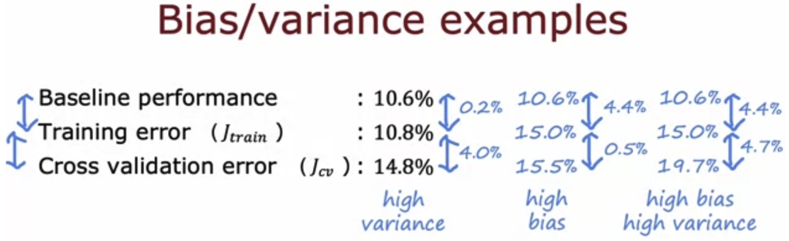

- [x] Compare the training error to the baseline level of performance
  - > Correct. If comparing your model's training error to a baseline level of performance (such as human level performance, or performance of other well-established models), if your model's training error is much higher, then this is a sign that the model has high bias (has underfit).
- [ ] Compare the training error to the cross validation error.
- [ ] See if the training error is high (above 15% or so) 
- [ ] See if the cross validation error is high compared to the baseline level of performance 

3. You find that your algorithm has high bias. Which of these seem like good options for improving the algorithm’s performance? Hint: two of these are correct. 

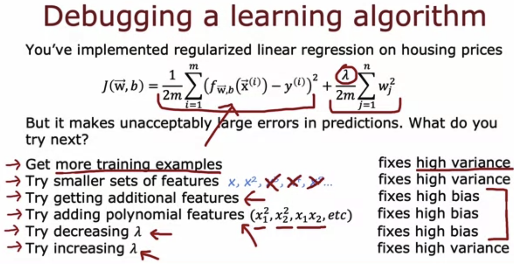

- [x] Decrease the regularization parameter $\lambda$
  - > Correct. Decreasing regularization can help the model better fit the training data.
- [ ] Remove examples from the training set
- [x] Collect additional features or add polynomial features 
  - > Correct. More features could potentially help the model better fit the training examples.
- [ ] Collect more training examples 

4. You find that your algorithm has a training error of 2%, and a cross validation error of 20% (much higher than the training error). Based on the conclusion you would draw about whether the algorithm has a high bias or high variance problem, which of these seem like good options for improving the algorithm’s performance? Hint: two of these are correct. 

- [ ] Reduce the training set size
- [x] Collect more training data
  - > Yes, the model appears to have high variance (overfit), and collecting more training examples would help reduce high variance.
- [x] Increase the regularization parameter $\lambda$
  - > Yes, the model appears to have high variance (overfit), and increasing regularization would help reduce high variance.
- [ ] Decrease the regularization parameter $\lambda$

## Quiz :clock3:: Machine learning development process

1. Which of these is a way to do error analysis? 

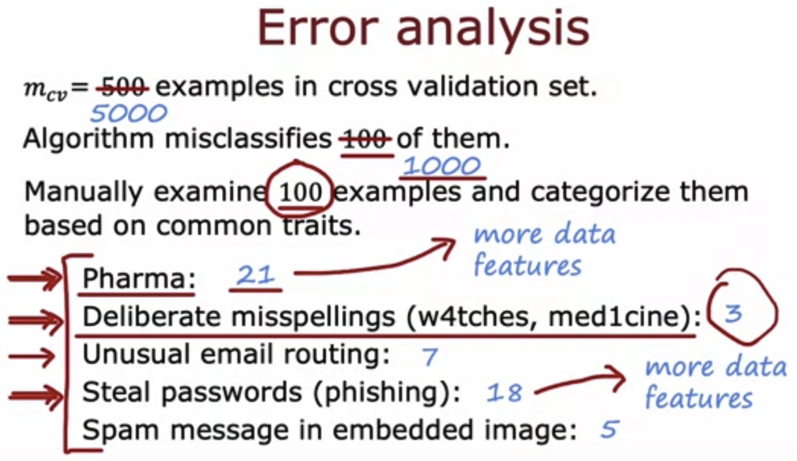

- [ ] Collecting additional training data in order to help the algorithm do better. 
- [x] Manually examine a sample of the training examples that the model misclassified in order to identify common traits and trends. 
  - > Correct. By identifying similar types of errors, you can collect more data that are similar to these misclassified examples in order to train the model to improve on these types of examples.
- [ ] Calculating the test error $J_{test}$
- [ ] Calculating the training error $J_{train}$

2. We sometimes take an existing training example and modify it (for example, by rotating an image slightly) to create a new example with the same label. What is this process called?

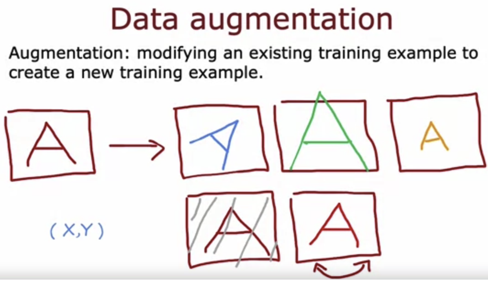

- [ ] Bias/variance analysis 
- [ ] Machine learning diagnostic
- [ ] Error analysis
- [x] Data augmentation
  - > Yes! Modifying existing data (such as images, or audio) is called data augmentation.

3. What are two possible ways to perform transfer learning? Hint: two of the four choices are correct.

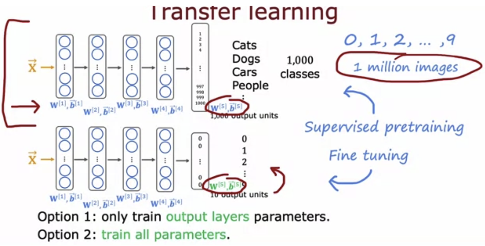

- [x] You can choose to train just the output layers' parameters and leave the other parameters of the model fixed.
  - > Correct. The earlier layers of the model may be reusable as is, because they are identifying low level features that are relevant to your task.
- [x] You can choose to train all parameters of the model, including the output layers, as well as the earlier layers.
  - > Correct. It may help to train all the layers of the model on your own training set. This may take more time compared to if you just trained the parameters of the output layers.
- [ ] Download a pre-trained model and use it for prediction without modifying or re-training it. 
- [ ] Given a dataset, pre-train and then further fine tune a neural network on the same dataset. 

---

# Week :four: - Decision trees

## Quiz :clock1:: Decision trees

1. Based on the decision tree shown in the lecture, if an animal has floppy ears, a round face shape and has whiskers, does the model predict that it's a cat or not a cat?

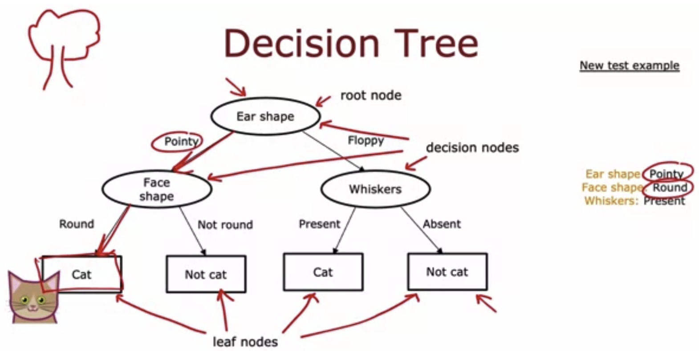

- [x] Cat
  - > Correct. If you follow the floppy ears to the right, and then from the whiskers decision node, go left because whiskers are present, you reach a leaf node for "cat", so the model would predict that this is a cat.
- [ ] Not a cat

2. Take a decision tree learning to classify between spam and non-spam email. There are 20 training examples at the root note, comprising 10 spam and 10 non-spam emails. If the algorithm can choose from among four features, resulting in four corresponding splits, which would it choose (i.e., which has highest purity)? 

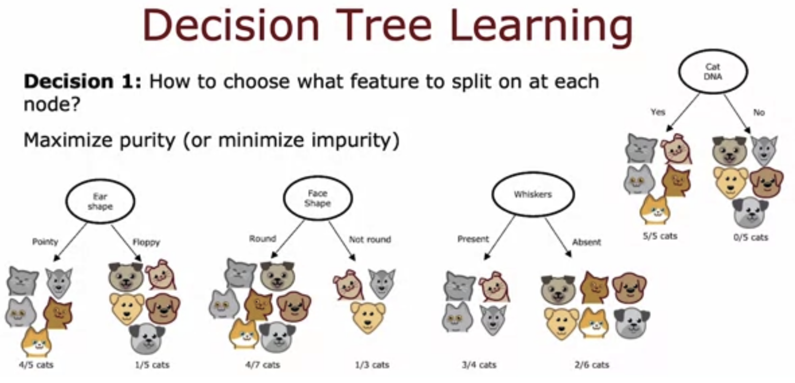

- [ ] Left split: 10 of 10 emails are spam. Right split: 0 of 10 emails are spam. 
- [ ] Left split: 2 of 2 emails are spam. Right split: 8 of 18 emails are spam. 
- [ ] Left split: 7 of 8 emails are spam. Right split: 3 of 12 emails are spam. 
- [x] Left split: 5 of 10 emails are spam. Right split: 5 of 10 emails are spam. 

## Quiz :clock2:: Decision tree learning

1. Recall that entropy was defined in lecture as $H(p_1) = - p_1 log_2(p_1) - p_0 log_2(p_0)$, where $p_1$ is the fraction of positive examples and $p_0$ the fraction of negative examples. At a given node of a decision tree, , 6 of 10 examples are cats and 4 of 10 are not cats. Which expression calculates the entropy $H(p_1)$ of this group of $10$ animals?

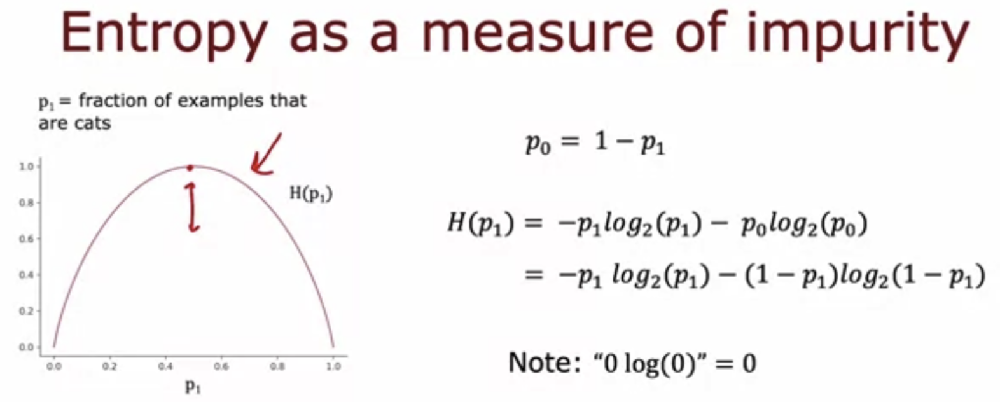

- [x] $-(0.6)\log_2(0.6) - (0.4)\log_2(0.4)$
  - > Correct. The expression is $-(p_1)\log_2(p_1) - (p_0)\log_2(p_0)$
- [ ] $(0.6)\log_2(0.6) + (1 - 0.4)\log_2(1 - 0.4)$
- [ ] $(0.6)\log_2(0.6) + (0.4)\log_2(0.4)$
- [ ] $-(0.6)\log_2(0.6) - (1 - 0.4)\log_2(1 - 0.4)$

2. Recall that information was defined as follows: $H(p_1^{root}) - (w^{left} H(p_1^{left}) + w^{right} H(p_1^{right}))$. Before a split, the entropy of a group of 5 cats and 5 non-cats is $H(\frac{5}{10})$. H(5/10). After splitting on a particular feature, a group of 7 animals (4 of which are cats) has an entropy of $H(\frac{4}{7})$. The other group of 3 animals (1 is a cat) and has an entropy of $H(\frac{1}{3})$. What is the expression for information gain?

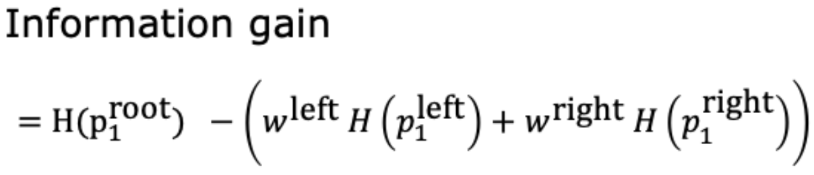

- [x] $H(0.5) + (\frac{7}{10} H(\frac{4}{7}) + \frac{3}{10} H(\frac{1}{3}))$
  - > Correct. The general expression is $H(p_1^{root}) - (w^{left} H(p_1^{left}) + w^{right} H(p_1^{right}))$.
- [ ] $H(0.5) + (7 * H(\frac{4}{7}) + 3 * H(\frac{1}{3}))$
- [ ] $H(0.5) + (\frac{4}{7} H(\frac{4}{7}) + \frac{4}{7} H(\frac{1}{3}))$
- [ ] $H(0.5) + (H(\frac{4}{7}) + H(\frac{1}{3}))$

3. To represent 3 possible values for the ear shape, you can define 3 features for ear shape: pointy ears, floppy ears, oval ears. For an animal whose ears are not pointy, not floppy, but are oval, how can you represent this information as a feature vector?

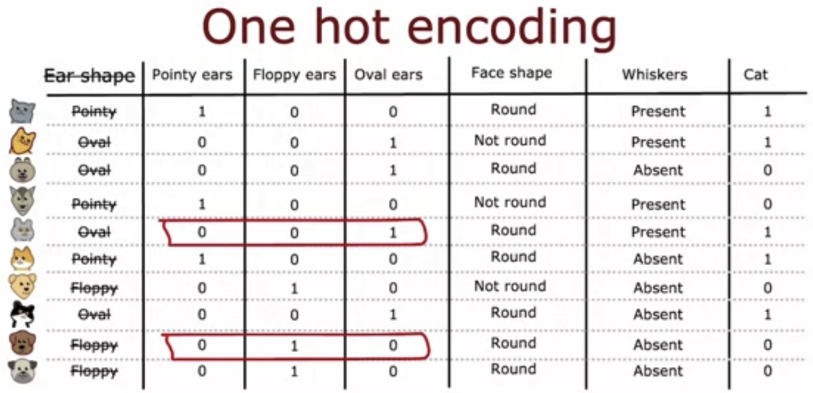

- [x] `[0, 0, 1]`
  - > Yes! 0 is used to represent the absence of that feature (not pointy, not floppy), and 1 is used to represent the presence of that feature (oval).
- [ ] `[1, 1, 0]`
- [ ] `[0, 1, 0]`
- [ ] `[1, 0, 0]`

4. For a continuous valued feature (such as weight of the animal), there are 10 animals in the dataset. According to the lecture, what is the recommended way to find the best split for that feature?

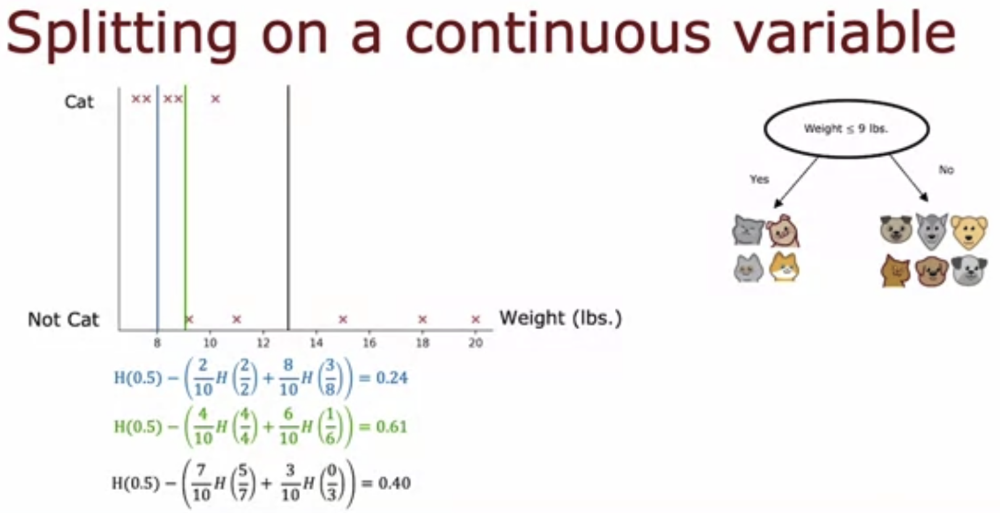

- [ ] Use a one-hot encoding to turn the feature into a discrete feature vector of 0’s and 1’s, then apply the algorithm we had discussed for discrete features. 
- [ ] Try every value spaced at regular intervals (e.g., 8, 8.5, 9, 9.5, 10, etc.) and find the split that gives the highest information gain.
- [x] Choose the 9 mid-points between the 10 examples as possible splits, and find the split that gives the highest information gain.
  - > Correct. This is what is proposed in the lectures.
- [ ] Use gradient descent to find the value of the split threshold that gives the highest information gain.


## Quiz :clock3:: Tree ensembles

1. For the random forest, how do you build each individual tree so that they are not all identical to each other?

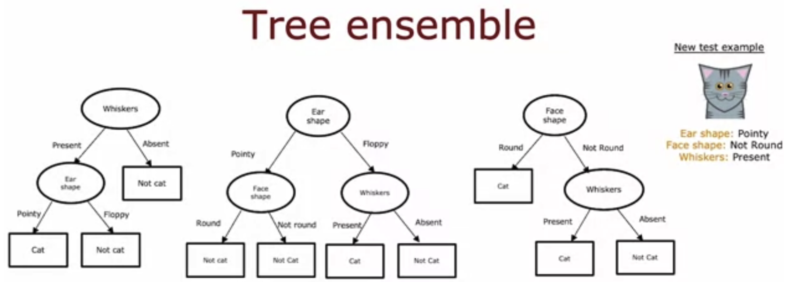

- [ ] If you are training B trees, train each one on 1/B of the training set, so each tree is trained on a distinct set of examples. 
- [ ] Train the algorithm multiple times on the same training set. This will naturally result in different trees. 
- [x] A: Sample the training data with replacement and select a random subset of features to build each tree
  - > Correct.  You can generate a training set that is unique for each individual tree by sampling the training data with replacement. The random forest algorithm further avoids identical trees by randomly selecting a subset of features when building the tree ensemble. 
- [ ] Sample the training data without replacement

2. You are choosing between a decision tree and a neural network for a classification task where the input $x$ x is a 100x100 resolution image. Which would you choose?

- [x] A neural network, because the input is unstructured data and neural networks typically work better with unstructured data. 
- [ ] A neural network, because the input is structured data and neural networks typically work better with structured data. 
- [ ] A decision tree, because the input is structured data and decision trees typically work better with structured data. 
- [ ] A decision tree, because the input is unstructured and decision trees typically work better with unstructured data. 

3. What does sampling with replacement refer to?

- [ ] It refers to using a new sample of data that we use to permanently overwrite (that is, to replace) the original data. 
- [ ] It refers to a process of making an identical copy of the training set.
- [x] Drawing a sequence of examples where, when picking the next example, first replacing all previously drawn examples into the set we are picking from. 
- [ ] Drawing a sequence of examples where, when picking the next example, first remove all previously drawn examples from the set we are picking from. 