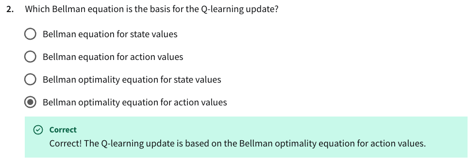

**Explanation**: 

Q-learning is an **off-policy** method. It updates using the **maximum future action value**, regardless of the current policy: 
$$
    Q(s, a) \rightarrow Q(s, a) + \alpha [ r + \gamma \max_{a'}Q(s', a') - Q(s, a) ]
$$
This directly corresponds to the **bellman optimality equation** for action-values $Q^*$: 
$$
    Q^*(s, a) = \mathbb{E}[ r + \gamma \max_{a'}Q^*(s', a') \; | \; s, a ]
$$

**Explanation**: 

Sarsa is **on-policy**. It updates the Q-value using the **next action actually taken**, not the max:
$$
    Q(s, a) \rightarrow Q(s, a) + \alpha [ r + \gamma Q(s', a') - Q(s, a) ]
$$
This is derived from the **standard Bellman equation for Q-values**, not the optimal one.

**Explanation**: 

Expected Sarsa takes the **expected value** over all possible next actions:
$$
    Q(s, a) \rightarrow Q(s, a) + \alpha [ r + \gamma \sum_{a'} \pi(a' | s')Q(a', s') - Q(s, a)]
$$
This is still **on-policy**, and still based on the **Bellman expectation equation** (not the optimality version), just with an expected value rather than a sampled one.

**Explanation**: 

- **Sarsa** only needs a **single sample**: the next action $a'$
- **Expected Sarsa** must compute a **weighted sum over all possible actions** using the policy $\pi(a' | s')$

So Expected Sarsa is **computationally more expensive** at each step, though often more stable.

**Explanation**: 

At a terminal state. the value of the next state is $0$, because there's no future reward. So for all three algorithms, the update target simplifies to: 
$$
    Q(s, a) \rightarrow Q(s, a) + \alpha [ r - Q(s, a) ]
$$

All use just the **final reward** as the target. Thus, their updates **converge** at terminal transitions.

Sarsa is an **online, on-policy TD (temporal-difference) algorithm**, meaning it **updates at every time step**, not at the end of the episode. It uses:
$$
    Q(s, a) \rightarrow Q(s, a) + \alpha [ r + \gamma Q(s', a') - Q(s, a) ]
$$
immediately after observing $s', a', r$.

| Algorithm        | Policy Type | Update Formula                                                                                         | Based on Bellman                          | Computation per Step                    |
|------------------|-------------|--------------------------------------------------------------------------------------------------------|-------------------------------------------|------------------------------------------|
| Q-learning       | Off-policy  | $Q(s,a) \leftarrow Q(s,a) + \alpha [r + \gamma \max_{a'} Q(s',a') - Q(s,a)]$                           | Optimality equation (action-values)       | Low (single max)                         |
| Sarsa            | On-policy   | $Q(s,a) \leftarrow Q(s,a) + \alpha [r + \gamma Q(s',a') - Q(s,a)]$                                    | Expectation equation (action-values)      | Low (single sample)                      |
| Expected Sarsa   | On-policy   | $Q(s,a) \leftarrow Q(s,a) + \alpha [r + \gamma \sum_{a'} \pi(a'\|s') Q(s',a') - Q(s,a)]$               | Expectation equation (action-values)      | Moderate (expected value over actions)   |
