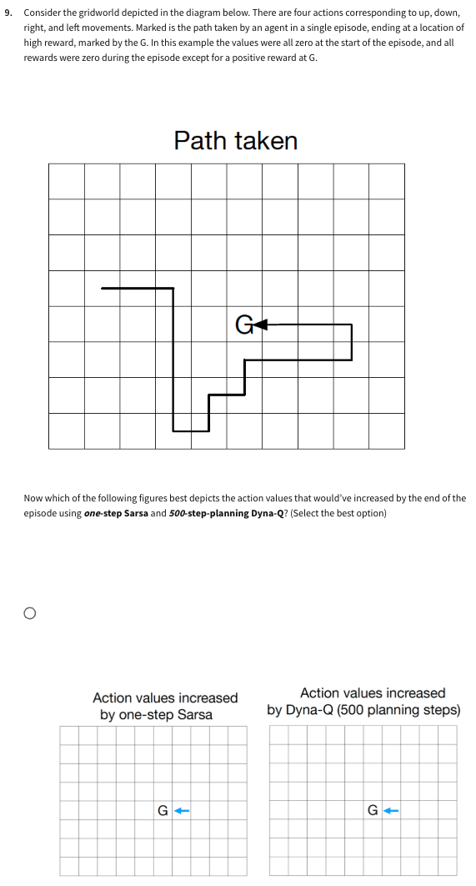

## 🧠 Module 5 Summary: Planning, Learning, and Acting

### Models
- **Distribution model**: stores full transition probabilities  
  $$
  P(s', r \mid s, a)
  $$
- **Sample model**: generates samples $(s', r) \sim P(\cdot \mid s, a)$
  → more memory-efficient

---

### Q-Planning
- Uses the **Q-learning update**:

  $$
  Q(s, a) \leftarrow Q(s, a) + \alpha \left[ r + \gamma \max_{a'} Q(s', a') - Q(s, a) \right]
  $$

- But applies it to **model-generated** transitions instead of real experience

---

### Dyna Architecture
- Combines **learning from real experience** and **planning from a model**
- Workflow:
  1. Real transitions update the model
  2. Model simulates experiences
  3. Simulated transitions are used for planning (Q-updates)

---

### Model Accuracy
- **Incomplete models** → may still be useful for planning
- **Wrong models** → lead to poor decisions and incorrect planning

---

### Dyna-Q+
- Encourages **exploration** via a reward bonus:

$$
  r' = r + \kappa \sqrt{\tau}
$$

  where $\tau$ is the time since last visit  
- Helps the agent explore less-visited actions to keep the model up to date

---

> Planning + learning enables faster improvement, and Dyna-Q+ ensures the model stays accurate through strategic exploration.
