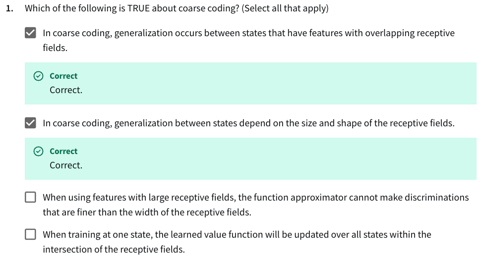

- When using features with large receptive fields, the function approximator cannot make distrimunations that are finer than the width of the receptive fields:
  - *Incorrect. The discrimination capability of the function approximator can be increased by increasing the number of features. Even though these features still have the same width receptive fields, the overlap allows for finer discrimination.*
- When training at one state, the learned value function will be updated over all states within the intersection of the receptive fields.
  - *Incorrect. The learned value function will be updated over all states within the **union** of the receptive fields.*

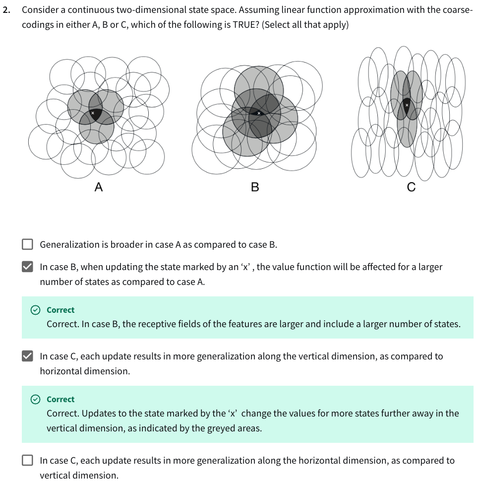

- Correct. In case B, the receptive fields of the features are larger and include a larger number of states.
- In case C

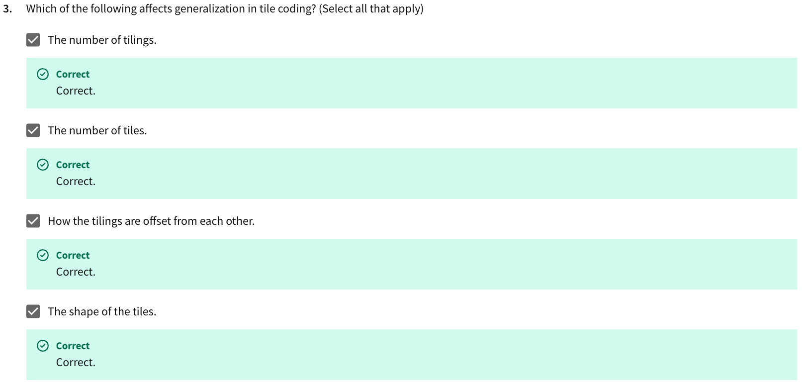

- Number of tilings: 
  - More tilings = more overlap = smoother generalization across nearby states.
- Number of tiles:
  - Fewer tiles per tiling = larger tiles = broader generalization.
  - More tiles = finer granularity = narrower generalization.
- Offset between tilings:
  - Offsets ensure different parts of the space are covered differently. Without offset, multiple tilings don’t provide additional generalization.
- Shape of the tiles:
  - Affects anisotropy of generalization (e.g., more generalization vertically vs. horizontally).

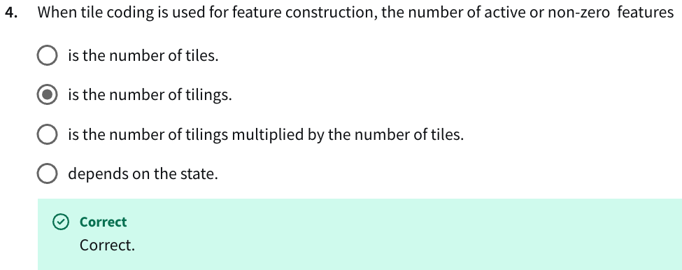

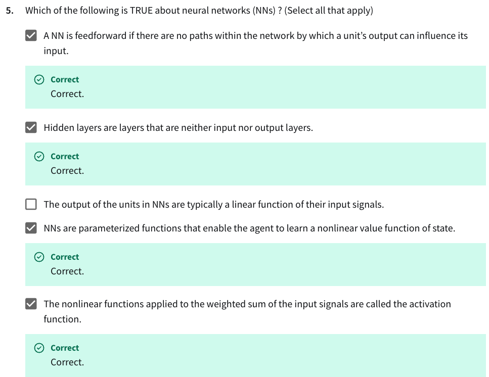

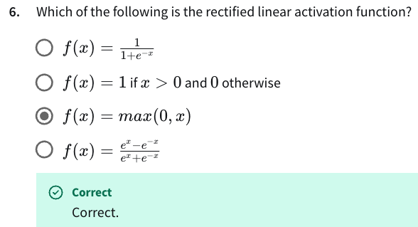

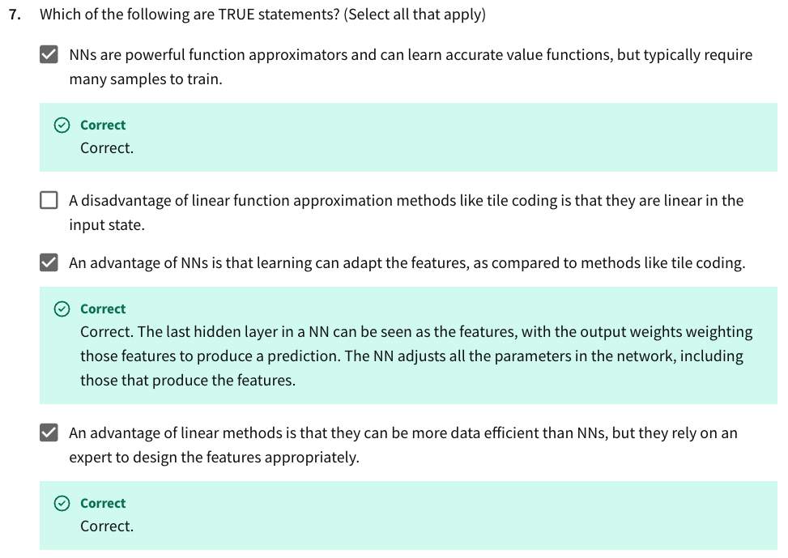

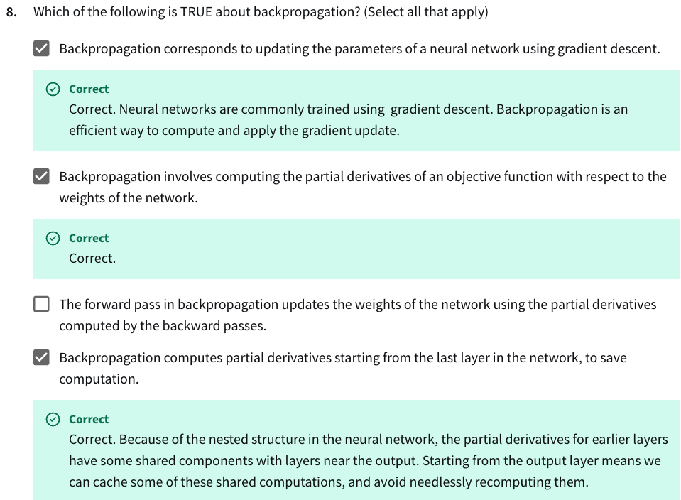

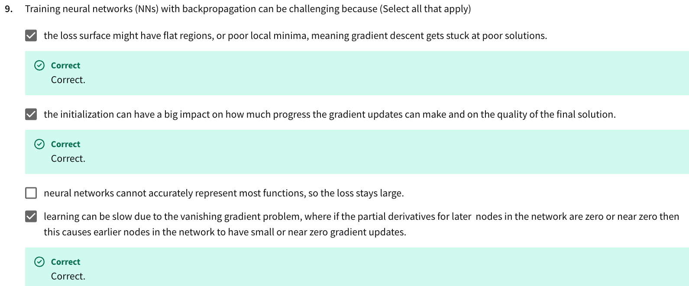

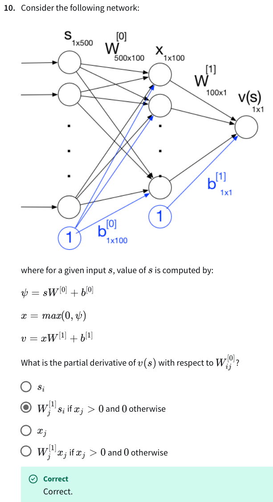

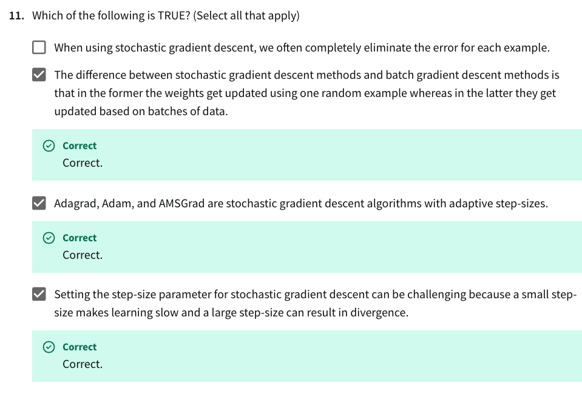

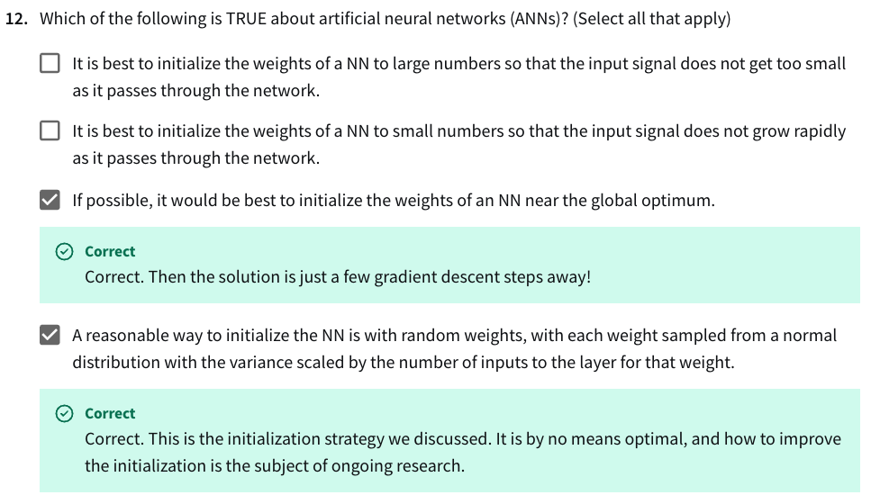
