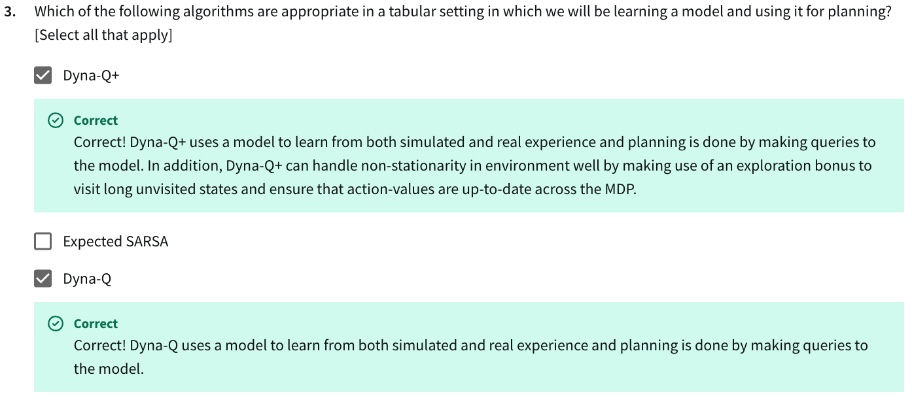

- NOT "Exploring Starts Monte-Carlo"
  - Incorrect. Exploring Starts Monte Carlo does control, which means that it aims to find a policy yielding large returns, rather than evaluating a policy.

- NOT "Expected SARSA"
  - Incorrect. Expected SARSA is a model-free method.

- NOT "Iterative Policy Evaluation"
  - Incorrect. Iterative policy evaluation is an algorithm for policy evaluation (i.e. prediction) rather than control.

- NOT "Gaussian Actor-Critic"
  - Incorrect. Gaussian Actor Critic parameterizes the policy with a gaussian distribution, which is continuous. It cannot be used with discrete actions.

- NOT "Gradient Monte Carlo"
  - Incorrect. Monte Carlo methods must wait until the end of the episode to make updates.
- NOT "SARSA"
  - Incorrect. SARSA is an algorithm that finds a policy that garners large returns (i.e., an algorithm for control) and is not an algorithm that estimates value functions given a policy (i.e., an algorithm for prediction.) 

- NOT "Expected SARSA"
  - Incorrect. Acrobot (as we described it) is a continuing task, which means that we should be using average reward.
- NOT "Q-Learning"
  - Incorrect. Acrobot (as we described it) is a continuing task, which means that we should be using average reward.

- NOT "Average Reward Actor-Critic"
  - Incorrect. Lunar lander is an episodic task, which means that the average reward formulation is not suitable.
